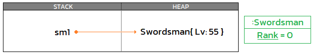

## Programming in the BIG picture
1. Fundamentals 👈
1. Solution design
1. Specific problems
1. Facilitators & Tools

> 🧙‍♂️ For any programming languages

===

<!-- .slide: data-auto-animate data-auto-animate-id="array" -->
## 🐣
## Fundamentals();
1. Array 👈
1. Value vs Reference
1. Strings
1. Date & Time
1. Classes & Objects

---

<!-- .slide: data-auto-animate data-auto-animate-id="array" -->
## Array
😭 Variable management problem
```csharp [0]
// John's wallets 👨‍🦰
int johnWallet1;
int johnWallet2;
int johnWallet3;

// Jane's wallets 👩
int janeWallet1;
int janeWallet2;
int janeWallet3;

// Jone's wallets 🎅
double joneWallet1;
double joneWallet2;
double joneWallet3;
double joneWallet4;
double joneWallet5;
double joneWallet6;
```
<!-- .element: style="width:45%" -->

---

<!-- .slide: data-auto-animate data-auto-animate-id="array" -->
## Array
🥰 Store multiple variables of the same type
```csharp [0]
int[] johnWallets;     // 👨‍🦰
int[] janeWallets;     // 👩
double[] joneWallets;  // 🎅
```
<!-- .element: style="width:45%" -->

---

<!-- .slide: data-auto-animate data-auto-animate-id="array" -->
## Array
> 📦→ [ 1 , 2 , 3 , ... , 10 ]
```csharp
int[] wallets = new int[10];
```
<!-- .element: style="width:40%" -->

---

<!-- .slide: data-auto-animate data-auto-animate-id="array" -->
## Array
> 📦→ [ 0 , 1 , 2 , ... , 9 ]
```csharp
int[] wallets = new int[10];
```
<!-- .element: style="width:40%" -->

```csharp [0]
// Set value
wallets[0] = 77;
wallets[1] = 10;
wallets[4] = 4321;

// Get value
Console.WriteLine(wallets[0]);   // Output: 77
Console.WriteLine(wallets[999]); // ❌ Error
Console.WriteLine(wallets[-1]);  // ❌ Error
```

---

<!-- .slide: data-auto-animate data-auto-animate-id="array" -->
## Array
Declare and set array element values
```csharp [0]
int[] wallets1 = new int[5];           // [ 0 , 0 , 0 , 0 , 0 ]
Console.WriteLine(wallets1.Length);    // Output: 5

int[] wallets2 = new int[]{ 3, 5, 7 }; // [ 3 , 5 , 7 ]
Console.WriteLine(wallets2.Length);    // Output: 3

int[] wallets3 = { 2, 4, 6, 8 };       // [ 2 , 4 , 6 , 8 ]
Console.WriteLine(wallets3.Length);    // Output: 4

int[] wallets4 = new int[0];           // []
Console.WriteLine(wallets4.Length);    // Output: 0
Console.WriteLine(wallets4[0]);        // ❌ Error

int[] wallets5;                        // null
Console.WriteLine(wallets5.Length);    // ❌ Error
```
⚠️ Length is immutable

---

<!-- .slide: data-auto-animate data-auto-animate-id="array" -->
## Array
Traversing Arrays
```csharp
string[] weekDays = new[]
{
    "Mon", "Tue",
    "Wed", "Thu", "Fri",
    "Sat", "Sun"
};
```
<!-- .element: style="width:40%" -->
```csharp [0]
// Manual ⚠️
for (int i = 0; i < weekDays.Length; i++)
{
    Console.WriteLine(weekDays[i]); // Mon, Tue, ... Sun
}

// foreach statement 👍
foreach (var item in weekDays)
{
    Console.WriteLine(item);        // Mon, Tue, ... Sun
}
```

---

<!-- .slide: data-auto-animate data-auto-animate-id="array" -->
## Array
1. Single-dimensional arrays
1. Multidimensional arrays
1. Jagged arrays (array of arrays)

---

<!-- .slide: data-auto-animate data-auto-animate-id="array" -->
## Array
1. Single-dimensional arrays

> 📦→ [ 0 , 1 , 2 , ... ]
```csharp [0]
int[] singleD = new int[] { 3, 5, 7 };
singleD[0] = 9;        // { 9, 5, 7 }
```

---

<!-- .slide: data-auto-animate data-auto-animate-id="array" -->
## Array
2. Multidimensional arrays

> 📦→ [ { 0,0,.. } , {0,1,..} , {1,0,..} , ... ]
```csharp [0]
int[,] multi2DA = new int[2, 1] { { 1 }, { 2 } }; // 🤔 Single?
int[,] multi2DB = new int[2, 2] { { 1, 2 }, { 3, 4 } };
int[,] multi2DC = new int[2, 3] { { 1, 2, 3 }, { 4, 5, 6 } };

multi2DA[0, 0] = 9;          // { { 9 }, { 2 } }
//multi2DA[0, 1] = 8;        // ❌ Error

multi2DB[0, 0] = 7;          // { { 7, 2 }, { 3, 4 } }
multi2DB[0, 1] = 6;          // { { 7, 6 }, { 3, 4 } }

Console.WriteLine(multi2DA.Length); // Output: 2
Console.WriteLine(multi2DB.Length); // Output: 4
Console.WriteLine(multi2DC.Length); // Output: 6
```

---

<!-- .slide: data-auto-animate data-auto-animate-id="array" -->
## Array
3. Jagged arrays (array of arrays)

> 📦→ [ 📦 , 📦 , ... , 📦 ]
```csharp [0]
int[][] jagged = new int[3][];
jagged[0] = new int[2];
jagged[1] = new int[3] { 1, 2, 3 };
jagged[2] = new[] { 11, 12, 13, 14, 15, 16 };

jagged[0][0] = 9; // { 9 , 0 }
jagged[0][1] = 8; // { 9 , 8 }
jagged[0][3] = 7; // ❌ Error

Console.WriteLine(jagged.Length);     // Output: 3
Console.WriteLine(jagged[0].Length);  // Output: 2
Console.WriteLine(jagged[1].Length);  // Output: 3
Console.WriteLine(jagged[2].Length);  // Output: 6
```

---

<!-- .slide: data-auto-animate data-auto-animate-id="array" -->
## Array
Array is like Matrix
`$$ 📦 = \begin{vmatrix}
1 & 2 & 3 \\
4 & 5 & 6 \\
7 & 8 & 9 \\
\end{vmatrix} $$`

```csharp
var 📦 = new int[3, 3]
{ 
	{ 1, 2, 3 },
	{ 4, 5, 6 },
	{ 7, 8, 9 },
};
```
<!-- .element: style="width:35%" -->

---

<!-- .slide: data-auto-animate data-auto-animate-id="array" -->
## Array
Implicitly typed arrays (var)
```csharp [0]
var singleD = new[] { "A", "B", "C" };  // string[3]
var multi3D = new[, ,]                  // int[2, 2, 3]
{
    {
        { 1, 2, 3 },
        { 4, 5, 6 },
    },
    {
        { 7, 8, 9 },
        { 10, 11, 12 },
    },
};
var jagged = new int[][]                // int[][]
{
    new [] { 1, 2 },
    new [] { 3, 4, 5 },
};
```

---

<!-- .slide: data-auto-animate data-auto-animate-id="array" -->
## Array
Passing arrays as arguments
```csharp [0]
void DoSomething(int[] collection)
{
	// Do something
}

var numbers = new[] { 1, 2, 3 };
DoSomething(numbers);
DoSomething(new[] { 4, 5, 6, 7, 8, 9 });
```

---

<!-- .slide: data-auto-animate data-auto-animate-id="array" -->
## Array
Passing arrays as arguments

with <font color="#5799d2">params</font> keyword
```csharp [0]
void DoSomething(params int[] collection)
{
    // Do something
}

DoSomething(1, 2, 3, 4, 5, 6, 7, 8, 9);
var numbers = new[] { 1, 2, 3 };
DoSomething(numbers);
DoSomething(new[] { 4, 5, 6, 7, 8, 9 });
```

---

<!-- .slide: data-auto-animate data-auto-animate-id="array" -->
## Array
Facilitator functions
```csharp
Array.Clear(), Array.Reverse(), Array.Sort(), Array.Fill(),
Array.AsReadOnly(), Array.BinarySearch(), Array.TrueForAll(),
Array.ConstrainedCopy(), Array.ForEach(), 
```

Example
```csharp
var collection = new[] { 7, 1, 5, 3 };
```
<!-- .element: style="width:55%" -->

```csharp [0]
Array.Reverse(collection);  // { 3, 5, 1, 7 }
Array.Sort(collection);     // { 1, 3, 5, 7 }
Array.Clear(collection);    // { 0, 0, 0, 0 }
Array.Fill(collection, 2);  // { 2, 2, 2, 2 }
```
<!-- .element: style="width:65%" -->

===

<!-- .slide: data-auto-animate data-auto-animate-id="valuereference" -->
## 🐣
## Fundamentals();
1. Array
1. Value vs Reference 👈
1. Strings
1. Date & Time
1. Classes & Objects

---

<!-- .slide: data-auto-animate data-auto-animate-id="valuereference" -->
## Value types vs Reference types
😭 I want it all, and I want it now !
> A = 🟢<br/>B = A&nbsp;&nbsp;&nbsp;&nbsp;<br/>B = 🔴
<!-- .element: style="width:35%" -->
1. A = 🟢 B = 🔴 Independent <!-- .element: class="fragment fade-up" -->
1. A = 🔴 B = 🔴 Dependent   <!-- .element: class="fragment fade-up" -->

---

<!-- .slide: data-auto-animate data-auto-animate-id="valuereference" -->
## Value types vs Reference types
😘 Two kinds of types in C#
1. Value types
1. Reference types

---

<!-- .slide: data-auto-animate data-auto-animate-id="valuereference" -->
## Value types vs Reference types
😘 Two kinds of types in C#
1. Value types

```csharp [0]
int walletA = 10;
int walletB = walletA;
walletB = 99;
Console.WriteLine(walletA);  // Output: 10
Console.WriteLine(walletB);  // Output: 99
```
<!-- .element: style="width:65%" -->
Independent

---

<!-- .slide: data-auto-animate data-auto-animate-id="valuereference" -->
## Value types vs Reference types
😘 Two kinds of types in C#

2. Reference types

```csharp [0]
int[] johnWallets = new int[] { 10 };
int[] elonWallets = johnWallets;
elonWallets[0] = 99;
Console.WriteLine(johnWallets[0]);  // Output: 99
Console.WriteLine(elonWallets[0]);  // Output: 99
```
<!-- .element: style="width:70%" -->
Dependent

---

<!-- .slide: data-auto-animate data-auto-animate-id="valuereference" -->
## Value types vs Reference types
💾 Data storing in a nutshell
1. Value types

```csharp [0]
int walletA = 10;
int walletB = walletA;
walletB = 99;
```
<!-- .element: style="width:40%" -->
<!-- .element: class="fragment" -->
<!-- .element: class="fragment" -->
<!-- .element: class="fragment" -->
<!-- .element: class="r-stack" -->
Assignment = Copy a value 😆
<!-- .element: class="fragment" -->

---

<!-- .slide: data-auto-animate data-auto-animate-id="valuereference" -->
## Value types vs Reference types
💾 Data storing in a nutshell

2. Reference types

```csharp [0]
int[] johnWallets = new int[] { 10 };
int[] elonWallets; 
elonWallets = johnWallets;
elonWallets[0] = 99;
```
<!-- .element: style="width:60%" -->
<!-- .element: class="fragment" -->
<!-- .element: class="fragment" -->
<!-- .element: class="fragment" -->
<!-- .element: class="fragment" -->
<!-- .element: class="r-stack" -->
Assignment/new keyword = assign an address
<!-- .element: class="fragment" -->

---

<!-- .slide: data-auto-animate data-auto-animate-id="valuereference" -->
## Value types vs Reference types

1. Value types

```csharp
// They always go where they were declared.
sbyte, byte, short, ushort, int, uint, long, ulong, nint, nuint,
bool, char, float, double, decimal, struct, enum, Tuple types
Nullable of value types
```

2. Reference types

```csharp
// They always go on the Heap.
class, interface, delegate, record, dynamic, object, string
```

---

<!-- .slide: data-auto-animate data-auto-animate-id="valuereference" -->
## Value types vs Reference types
Unsafe code & Pointer types

For performance optimization, We can write code in **unsafe context** for use pointers, manually allocate and free blocks of memory, and call methods using function pointers.
<!-- .element: style="width:110%" -->

```csharp [0]
int number = 1024;
unsafe
{
    byte* p = (byte*)&number;
    for (int i = 0 ; i < sizeof(int) ; ++i)
    {
        Console.Write(" {0:X2}", *p); // Output: 00 04 00 00
        p++;
    }
}
```

===

<!-- .slide: data-auto-animate data-auto-animate-id="string" -->
## 🐣
## Fundamentals();
1. Array
1. Value vs Reference
1. Strings 👈
1. Date & Time
1. Classes & Objects

---

<!-- .slide: data-auto-animate data-auto-animate-id="string" -->
## Strings
🤨 Is there really anything to worry about ?

---

<!-- .slide: data-auto-animate data-auto-animate-id="string" -->
## Strings
How to change the text to capitalization case ?
> quick brown fox jumps over the lazy dog
<!-- .element: style="width:100%" -->
```csharp [0]
var original = "quick brown fox jumps over the lazy dog";
original = "Quick Brown Fox Jumps Over The Lazy Dog";
```
<!-- .element: class="fragment fade-up" -->
🤔 Streaming data? Profanity filter?
<!-- .element: class="fragment fade-up" -->

---

<!-- .slide: data-auto-animate data-auto-animate-id="string" -->
## Strings
😿 Hello string, my old friend

---

<!-- .slide: data-auto-animate data-auto-animate-id="string" -->
## Strings
😿 Hello string, my old friend

> "Hello"

> 📦→ [ 'H' , 'e' , 'l', 'l', 'o' ]

Read-only collection of <font color="#5799d2">char</font>

---

<!-- .slide: data-auto-animate data-auto-animate-id="string" -->
## Strings
Read-only collection of <font color="#5799d2">char</font>

```csharp
var text = "Hello";
foreach (var item in text)
{
    Console.WriteLine(item);  // Output: 'H' , 'e' , 'l', 'l', 'o'
}

char secondChar = text[1];    // 'e'
text[1] = 'a';                // ❌ Error - read only
```

---

<!-- .slide: data-auto-animate data-auto-animate-id="string" -->
## Strings
🔒 String values are immutable

⚠️ Modification is actually a new string creation
```csharp [0]
string firstName = "John";
string lastName = "Doe";
firstName += lastName;
```
<!-- .element: style="width:40%" -->
<!-- .element: class="fragment" -->
<!-- .element: class="fragment" -->
<!-- .element: class="fragment" -->
<!-- .element: class="fragment" -->
<!-- .element: class="r-stack" -->
Assignment/new keyword = assign an address
<!-- .element: class="fragment" -->

---

<!-- .slide: data-auto-animate data-auto-animate-id="string" -->
## Strings
😵‍💫 String is a reference type but looks like a value type
```csharp [0]
string firstName = "John";
string lastName = firstName;
firstName = "Doe";
Console.WriteLine(firstName); // Output: Doe
Console.WriteLine(lastName);  // Output: John
```
<!-- .element: style="width:70%" -->
🔒 String values are immutable

<!-- .element: class="fragment" -->
<!-- .element: class="fragment" -->
<!-- .element: class="fragment" -->
<!-- .element: class="fragment" -->
<!-- .element: class="r-stack" -->

---

<!-- .slide: data-auto-animate data-auto-animate-id="string" -->
## Strings
⚠️ String operations can affect performance

```csharp [0]
string text = null;
for (int i = 0; i < 1000000; i++)
{
    text += "John";
}
Console.WriteLine(text); // 😴zZzZ
```
<!-- .element: style="width:50%" -->


👍 StringBuilder

---

<!-- .slide: data-auto-animate data-auto-animate-id="string" -->
## Strings
### Format strings
Quoted & Verbatim string literals
```csharp [0]
// Quoted string literals (single line)
string filePath = "c:\\users\\public";
string textWithQuote = "You can type \"Quote\" in here";
string multiLine = "{\n" +
    "  name: \"C# fundamental course\"\n" +
    "}";
```
<!-- .element: style="width:80%" -->
```csharp [0]
// Verbatim string literals (multi-line)
string filePath = @"c:\users\public";
string textWithQuote = @"You can type ""Quote"" in here";
string multiLine = @"{
  name: ""C# fundamental course""
}";
```
<!-- .element: style="width:80%" -->
🔤 Escape sequences

---

<!-- .slide: data-auto-animate data-auto-animate-id="string" -->
## Strings
### Format strings
Raw string literals
```csharp
string filePath = """c:\users\public""";
string textWithQuote = """You can type "Quote" in here""";
string multiLine = """
    {
      name: "C# fundamental course"
    }
    """;
```
<!-- .element: style="width:80%" -->
⛔ Escape sequences

---

<!-- .slide: data-auto-animate data-auto-animate-id="string" -->
## Strings
[Escape sequence](https://docs.microsoft.com/en-us/dotnet/csharp/programming-guide/strings/#string-escape-sequences)
|Escape|Character||||Escape|Character|
|--|--|--|--|--|--|--|
|\\'|'||||\\"|"|
|\\\ |\ ||||\\0|Null|
|\v|VerticalTab||||\b|Backspace|
|\f|Form feed||||\n|New line|
|\r|Return||||\t|HorizontalTab|

---

<!-- .slide: data-auto-animate data-auto-animate-id="string" data-background="white" -->
## Code smell
[Escape sequence](https://docs.microsoft.com/en-us/dotnet/csharp/programming-guide/strings/#string-escape-sequences)
|Escape sequence|Platform specific|
|--|--|
|\r\n|non-Unix|
|\n|Unix platforms|

> 👍 <font color="#5799d2">Environment</font>.NewLine

---

<!-- .slide: data-auto-animate data-auto-animate-id="string" -->
## Strings
### Format strings
Composite formatting (placeholder)
```csharp
int age = 3;
string name = "Saladpuk";
string text = string.Format("{0} is {1} year old", name, age);
Console.WriteLine(text);     // Saladpuk is 3 year old
```

---

<!-- .slide: data-auto-animate data-auto-animate-id="string" -->
## Strings
### Format strings
String interpolation
```csharp [0]
int age = 3;
string name = "Saladpuk";
string text = $"{name} is {age} year old";
Console.WriteLine(text);     // Saladpuk is 3 year old

string fileName = "README.md";
string filePath = $@"c:\users\public\{fileName}";
Console.WriteLine(filePath); // c:\users\public\README.md
```
Readability & Maintainability

---

<!-- .slide: data-auto-animate data-auto-animate-id="string" -->
## Strings
[Standard numeric format strings](https://docs.microsoft.com/en-us/dotnet/standard/base-types/standard-numeric-format-strings#standard-format-specifiers)
|Format Specifier|Name|Example|
|--|--|--|
|N|Number|1000 (N) > 1,000.00|
|P|Percent|0.35 (P) > 35.00%|
|C|Currency|1000 (C0) > $1,000|
|E|Exponential|12.3 (E2) > 1.23E+001|
|X|Hexadecimal|1023 (X4) > 03FF|
<!-- .element: style="width:110%" -->

[Format specifier][Precision specifier 0~99]

---

<!-- .slide: data-auto-animate data-auto-animate-id="string" -->
## Strings
Globalize vs Localize  
1000.23
|Language|Code|Currency|Number|
|--|--|--|--|
|United States|en-US|$1,000.23|1,000.23|
|Thailand|th-TH|฿1,000.23|1,000.23|
|Japan|ja-JP|¥1,000|1,000.23|
|Germany|de-DE|1.000,23 €|1.000,23|
|Russia|ru-RU|1 000,23 ₽|1 000,23|

---

<!-- .slide: data-auto-animate data-auto-animate-id="string" -->
## Strings
CultureInfo
```csharp [0]
using System.Globalization;

const double number = 1000.23;
var cultures = new[] { "en-us", "th-th", "ja-jp", "de-de", "ru-ru" };
foreach (var item in cultures)
{
    var culture = CultureInfo.CreateSpecificCulture(item);
    var name = culture.EnglishName;
    var nativeNumber = number.ToString("N", culture);
    Console.WriteLine($"{name,-25} {nativeNumber}");
}

// Output:
// English (United States)   1,000.23
// Thai (Thailand)           1,000.230
// Japanese (Japan)          1,000.230
// German (Germany)          1.000,230
// Russian (Russia)          1 000,230
```
<!-- .element: style="width:100%" -->

---

<!-- .slide: data-auto-animate data-auto-animate-id="string" -->
## Strings
Facilitator functions

```csharp
string.Empty, string.Join(), string.Concat(), string.Format(),
string.IsNullOrEmpty(), string.IsNullOrWhiteSpace()
"".Contains(), "".EndsWith(), "".IndexOf(), "".Insert(),
"".LastIndexOf(), "".PadLeft(), "".PadRight(), "".Replace(),
"".Split(), "".StartsWith(), "".Substring(), "".ToCharArray(),
"".ToLower(), "".ToUpper(), "".Trim(), "".TrimEnd(), "".TrimStart()
Path.Combine(), Path.GetFileName(), Path.GetPathRoot(), ...
```
🎮 Challenge
```csharp [0]
string[] alphabets = new[] { "A", "B", "C", "D", "E" };
string result = 🤔;
Console.WriteLine(result);
// Expected result: "A then B then C then D then E"
```
<!-- .element: style="width:80%" -->

---

<!-- .slide: data-auto-animate data-auto-animate-id="string" -->
## Strings
🎮 Challenge
```csharp [0]
string message = input;
// The input might be { null, "", " ", "  ", "   " }
bool isContainSomethingExceptPureWhiteSpace = 🤔
if ( isContainSomethingExceptPureWhiteSpace )
{
    // Do something
}
```
<!-- .element: style="width:75%" -->

---

<!-- .slide: data-auto-animate data-auto-animate-id="string" -->
## Strings
🎮 Challenge
> quick brown fox jumps over the lazy dog
<!-- .element: style="width:100%" -->
```csharp [0]
using System.Globalization;

var original = "quick brown fox jumps over the lazy dog";
var txtInfo = CultureInfo.CurrentCulture.TextInfo;
var result = txtInfo.ToTitleCase(original);
Console.WriteLine(result);
// Output: Quick Brown Fox Jumps Over The Lazy Dog
```
<!-- .element: class="fragment fade-up" -->

---

<!-- .slide: data-auto-animate data-auto-animate-id="string" data-background="white" -->
## Code smell
Their solutions might not suit your problem


===

<!-- .slide: data-auto-animate data-auto-animate-id="datetime" -->
## 🐣
## Fundamentals();
1. Array
1. Value vs Reference
1. Strings
1. Date & Time 👈
1. Classes & Objects

---

<!-- .slide: data-auto-animate data-auto-animate-id="datetime" -->
## Date & Time
😭 Anybody help

> 🗓️ What day of the week is 29th September ?

> ⌚ What time, in Thailand timezone, does US stock market open ?

> ⌚ How long is 73,321 sec in hours ?


---

<!-- .slide: data-auto-animate data-auto-animate-id="datetime" -->
## Date & Time
😿 We've come to talk with DateTime again

---

<!-- .slide: data-auto-animate data-auto-animate-id="datetime" -->
## Date & Time
😿 We've come to talk with DateTime again

> 5/9/2022 12:30:00 AM

> 🗓️ Date (5/9/2022)  
> ⌚ Time (12:30:00 AM)

---

<!-- .slide: data-auto-animate data-auto-animate-id="datetime" -->
## Date & Time
C# DateTime
> <font color="#5799d2">new</font> <font color="#86c691">DateTime</font>();
<!-- .element: style="width:40%" -->
```csharp [0]
DateTime date = new DateTime(2022, 9, 5, 13, 45, 30);
Console.WriteLine(date.DayOfYear); // 248
Console.WriteLine(date.DayOfWeek); // Monday
Console.WriteLine(date.TimeOfDay); // 13:45:30

DateTime now = DateTime.Now;
```
<!-- .element: style="width:75%" -->
😄 Easy right ?

---

<!-- .slide: data-auto-animate data-auto-animate-id="datetime" -->
## Date & Time
C# DateTime
> <font color="#5799d2">new</font> <font color="#86c691">DateTime</font>();
<!-- .element: style="width:40%" -->
```csharp [0]
new DateTime(tick);
new DateTime(tick, kind);
new DateTime(year, month, day);
new DateTime(year, month, day, calendar);
new DateTime(year, month, day, hour, minute, second);
new DateTime(year, month, day, hour, minute, second, kind);
new DateTime(year, month, day, hour, minute, second, calendar);
new DateTime(year, month, day, hour, minute, second, millisecond);
new DateTime(year, month, day, hour, minute, second, millisecond, kind);
new DateTime(year, month, day, hour, minute, second, millisecond, calendar);
// ...
```
<!-- .element: style="width:110%" -->
🤨 Tick? Kind? Calendar?

---

<!-- .slide: data-auto-animate data-auto-animate-id="datetime" -->
## Date & Time
🌎 TimeZone & Culture


---

<!-- .slide: data-auto-animate data-auto-animate-id="datetime" -->
## Date & Time
C# DateTime → long
> Time values are measured in 100ns units called ticks
<!-- .element: style="width:60%" -->
```csharp
           0 = 1/1/0001 12:00:00 AM
    10000000 = 1/1/0001 12:00:01 AM
   600000000 = 1/1/0001 12:01:00 AM
 36000000000 = 1/1/0001 01:00:00 AM
```
<!-- .element: style="width:50%" -->

```csharp
long ticks = new DateTime(2022, 9, 5, 3, 45, 30).Ticks;
Console.WriteLine(ticks); // Output: 637979463300000000

DateTime date = new DateTime(637979463300000000);
Console.WriteLine(date); // Output: 9/5/2022 3:45:30 AM
```
<!-- .element: style="width:80%" -->

---

<!-- .slide: data-auto-animate data-auto-animate-id="datetime" -->
## Date & Time
TimeSpan

```csharp [0]
DateTime oneAM = new DateTime(2022, 9, 5, 1, 0, 0);
DateTime midnight = new DateTime(2022, 9, 5);
TimeSpan diff = midnight - oneAM;
Console.WriteLine(diff);                  // Output: -01:00:00

var timespan = new TimeSpan(25, 45, 15);
Console.WriteLine(timespan.Days);         // Output: 1
Console.WriteLine(timespan.Hours);        // Output: 1
Console.WriteLine(timespan.Minutes);      // Output: 45
Console.WriteLine(timespan.Seconds);      // Output: 15
Console.WriteLine(timespan.TotalSeconds); // Output: 92715
```
⌚ TimeSpan is represents a time interval

---

<!-- .slide: data-auto-animate data-auto-animate-id="datetime" -->
## Date & Time
🤨 What about TimeZone & Culture ?


---

<!-- .slide: data-auto-animate data-auto-animate-id="datetime" -->
## Date & Time
#### TimeZone (Local, Utc, Unspecified)
```csharp [0]
DateTime origin = new DateTime(2022, 9, 5);

DateTime local = DateTime.SpecifyKind(origin, DateTimeKind.Local);
Console.WriteLine(local);                         // Output: 9/5/2022 12:00:00 AM
Console.WriteLine(local.ToLocalTime());           // Output: 9/5/2022 12:00:00 AM
Console.WriteLine(local.ToUniversalTime());       // Output: 9/4/2022  5:00:00 PM

DateTime utc = DateTime.SpecifyKind(origin, DateTimeKind.Utc);
Console.WriteLine(utc);                           // Output: 9/5/2022 12:00:00 AM
Console.WriteLine(utc.ToLocalTime());             // Output: 9/5/2022  7:00:00 AM
Console.WriteLine(utc.ToUniversalTime());         // Output: 9/5/2022 12:00:00 AM

DateTime unspecified = DateTime.SpecifyKind(origin, DateTimeKind.Unspecified);
Console.WriteLine(unspecified);                   // Output: 9/5/2022 12:00:00 AM
Console.WriteLine(unspecified.ToLocalTime());     // Output: 9/5/2022  7:00:00 AM
Console.WriteLine(unspecified.ToUniversalTime()); // Output: 9/4/2022  5:00:00 PM

DateTime now = DateTime.Now;                      // Kind: Local
DateTime utcNow = DateTime.UtcNow;                // Kind: Utc
```
<!-- .element: style="width:115%" -->

---

<!-- .slide: data-auto-animate data-auto-animate-id="datetime" -->
## Date & Time
TimeZoneInfo
```csharp [0]
DateTime origin = new DateTime(2022, 9, 5);
DateTime local = DateTime.SpecifyKind(origin, DateTimeKind.Local);

TimeZoneInfo timezone = TimeZoneInfo.FindSystemTimeZoneById("Tokyo Standard Time");
DateTime japan = TimeZoneInfo.ConvertTime(local, TimeZoneInfo.Local, timezone);
Console.WriteLine(japan); // Output: 9/5/2022  2:00:00 AM
Console.WriteLine(local); // Output: 9/5/2022 12:00:00 AM
```
<!-- .element: style="width:115%" -->

---

<!-- .slide: data-auto-animate data-auto-animate-id="datetime" -->
## Date & Time
Culture
```csharp [0]
DateTime date = new DateTime(2022, 9, 5, 1, 45, 30);
var cultures = new[] { "en-us", "th-th", "hi-in" };
foreach (var item in cultures)
{
    var culture = new CultureInfo(item);
    Console.WriteLine(date.ToString("D", culture));
}
// Output:
// Monday, September 5, 2022
// วันจันทร์ที่ 5 กันยายน พ.ศ. 2565
// सोमवार, 5 सितंबर 2022
```
<!-- .element: style="width:80%" -->
```csharp [0]
var culture = CultureInfo.CreateSpecificCulture(item);
Thread.CurrentThread.CurrentCulture = culture;
```
<!-- .element: style="width:80%" -->

---

<!-- .slide: data-auto-animate data-auto-animate-id="datetime" -->
## Date & Time
🗓️ Calendar classes

```csharp
ChineseLunisolarCalendar, GregorianCalendar, HebrewCalendar,
HijriCalendar, JapaneseCalendar, JapaneseLunisolarCalendar,
JulianCalendar, KoreanCalendar, KoreanLunisolarCalendar,
PersianCalendar, TaiwanCalendar, TaiwanLunisolarCalendar,
ThaiBuddhistCalendar, UmAlQuraCalendar
```

```csharp
Calendar thai = new ThaiBuddhistCalendar();
var thaiDate = new DateTime(2565, 9, 5, thai);
Console.WriteLine(thaiDate);   // Output: 9/5/2022 12:00:00 AM

Calendar korean = new KoreanCalendar();
var koreanDate = new DateTime(4355, 9, 5, korean);
Console.WriteLine(koreanDate); // Output: 9/5/2022 12:00:00 AM
```

---

<!-- .slide: data-auto-animate data-auto-animate-id="datetime" -->
## Date & Time
🎮 Challenge

> How long is 73,321 sec in hours ?

```csharp [0]
var ts = TimeSpan.FromSeconds(73321);
Console.WriteLine(ts.Hours); // Output: 20
```
<!-- .element: style="width:60%" class="fragment fade-up" -->

---

<!-- .slide: data-auto-animate data-auto-animate-id="datetime" data-background="white" -->
## Code smell

😿 Some things you should not DIY

===

<!-- .slide: data-auto-animate data-auto-animate-id="class" -->
## 🐣
## Fundamentals();
1. Array
1. Value vs Reference
1. Strings
1. Date & Time
1. Classes & Objects 👈

---

<!-- .slide: data-auto-animate data-auto-animate-id="class" -->
## Classes & Objects
😭 Build-in types aren't enough

> int, double, float, byte, sbyte, decimal, uint, nint, nuint, long, ulong, short, ushor, string, char, bool, object, dynamic, Array, Datetime, TimeSpan

🦭 feed me!, hUmAN

---

<!-- .slide: data-auto-animate data-auto-animate-id="class" -->
## Classes & Objects
😄 Custom types
```csharp
Seal saladpuk = new Seal();
do
{
    saladpuk.Feed( FISH );
} while(saladpuk.StillAngry);
```
<!-- .element: style="width:45%" -->
🦭 I never get satisfied from eating

---

<!-- .slide: data-auto-animate data-auto-animate-id="class" -->
## Classes & Objects
😄 Custom types

> <font color="#5799d2">AccessModifier class</font> ClassName { }

```csharp
public class Swordsman
{
   // Fields       ⭐
   // Methods      ⭐
   // Constructure ⭐
   // Properties
   // Events
}
```
<!-- .element: style="width:31%" -->
```csharp
Swordsman object1 = new Swordsman();
Swordsman object2 = new Swordsman();
Swordsman object3 = new Swordsman();
```
<!-- .element: style="width:50%" -->

---

<!-- .slide: data-auto-animate data-auto-animate-id="class" -->
## Classes & Objects
⭐ Fields & 🔒AccessModifier
```csharp [0]
public class Swordsman
{
    // Fields
    public string Motto;        // 🔓 Everyone
    internal string NickName;   // 🔐 Only my clan 
    protected string SwordName; // 🔐 Only my child
    private int exp;            // 🔒 Only me
}
```
<!-- .element: style="width:75%" -->
```csharp
var sm = new Swordsman();
sm.Motto = "Stay hungry";
sm.NickName = "Au";
sm.SwordName = "Excalibur";  // ❌ Error
sm.exp = 100;                // ❌ Error
```
<!-- .element: style="width:60%" -->
💾 Data

---

<!-- .slide: data-auto-animate data-auto-animate-id="class" -->
## Classes & Objects
⭐ Methods
```csharp [0]
public class Swordsman
{
    // Fields
    private int exp;  // 🔒 Only me

    // Methods
    public int GetExp() { return exp; }
    public void SetExp(int amount) { exp = amount; }
    public void Attack(Swordsman enemy) { ... }
}
```
<!-- .element: style="width:80%" -->
```csharp
var sm1 = new Swordsman();
var sm2 = new Swordsman();
sm1.Attack(sm2);
sm1.SetExp(10);
```
<!-- .element: style="width:40%" -->
🤺 Behaviours

---

<!-- .slide: data-auto-animate data-auto-animate-id="class" -->
## Classes & Objects
⭐ Methods overloading
```csharp [0]
public class Swordsman
{
    public void Attack(Swordsman enemy) { ... }
    public void Attack(Swordsman enemy, bool isCritical) { ... }
    public void Attack(Monster[] enemies) { ... }
    public bool Attack(Monster[] enemies, bool isAssist) { ... }
    public object Attack(object enemy) { ... }
    public object Attack(object[] enemies) { ... }
}
```
👯‍♀️ Same name but different parameters

---

<!-- .slide: data-auto-animate data-auto-animate-id="class" -->
## Classes & Objects
⭐ Constructors & 💥 Destructors
```csharp [0]
public class Swordsman
{
    // Fields
    public int Money;
    public int HealthPoints;
    public int StaminaPoints;

    public Swordsman()
    {
        HealthPoints = 100;
        StaminaPoints = 50;
    }
    public Swordsman(int initMoney) : this()
    {
        Money = initMoney;
    }
    ~Swordsman() { ... } // 💥 Destructors
}
```
<!-- .element: style="width:70%" -->

---

<!-- .slide: data-auto-animate data-auto-animate-id="class" -->
## Classes & Objects
⚒️ Properties
```csharp [0]
public class Swordsman
{
    // Fields
    private int exp;  // 🔒 Only me

    // Get/Set methods for a field
    public int GetExp() { return exp; }
    public void SetExp(int amount) 
    { 
        if (amount > 0) exp = amount; 
    }
}
```
<!-- .element: style="width:60%" -->
🥱 Good old days

---

<!-- .slide: data-auto-animate data-auto-animate-id="class" -->
## Classes & Objects
⚒️ Properties
```csharp [0]
public class Swordsman
{
    // Fields
    private int exp;

    // Properties
    public int Exp
    {
        get { return exp; }
        set
        {
            if (value > 0) exp = value;
        }
    }
    public int Money { get; protected set; }
}
```
<!-- .element: style="width:70%" -->
😍 Easier, Simpler, Faster

---

<!-- .slide: data-auto-animate data-auto-animate-id="class" -->
## Classes & Objects
💞 It's a reference type
```csharp [0]
public class Swordsman
{
    public int Level { get; set; }
    public string Name { get; set; }
}

var sm1 = new Swordsman { Level = 1, Name = "Au", };
var sm2 = sm1;
sm2.Name = "Saladpuk";
sm2.Level = 77777777;
Console.WriteLine(sm1 == sm2);
```
<!-- .element: style="width:80%" -->

---

<!-- .slide: data-auto-animate data-auto-animate-id="class" -->
## Classes & Objects
Operator overloading
```csharp [0]
public class Swordsman
{
    public int HealthPoints { get; set; }
    public Swordsman(int hp) => HealthPoints = hp;

    public static Swordsman operator +(Swordsman a)
         => a;
    public static Swordsman operator -(Swordsman a)
        => new Swordsman(-a.HealthPoints);
    public static Swordsman operator +(Swordsman a, Swordsman b)
        => new Swordsman(a.HealthPoints + b.HealthPoints);
    public static Swordsman operator -(Swordsman a, Swordsman b)
        => new Swordsman(a.HealthPoints - b.HealthPoints);
}
```
<!-- .element: style="width:95%" -->
```csharp
var result = new Swordsman(5) + new Swordsman(100);
Console.WriteLine(result.HealthPoints);
```
<!-- .element: style="width:70%" -->

---

<!-- .slide: data-auto-animate data-auto-animate-id="class" -->
## <font color="#5799d2">static</font> keyword

```csharp [0]
public class Swordsman
{
    public int Lv;          // Object's member
    public static int Rank; // Data type's member
    public void ShowRank() => Console.WriteLine(Rank);
}
```
<!-- .element: style="width:80%" -->
```csharp [0]
var sm1 = new Swordsman();
sm1.Lv = 55;
//sm1.Rank = 77; // ❌ Error
sm1.ShowRank();  // Output: 0
Swordsman.Rank = 100;
sm1.ShowRank();  // Output: 100
var sm2 = new Swordsman();
sm2.ShowRank();  // Output: 100
```
<!-- .element: style="width:60%" -->
<!-- .element: class="fragment" -->
<!-- .element: class="fragment" -->
<!-- .element: class="fragment" -->
<!-- .element: class="r-stack" -->

---

<!-- .slide: data-auto-animate data-auto-animate-id="class" -->
## Classes & Objects
Extension methods
```csharp [0]
public class Swordsman
{
    public int HealthPoints { get; set; }
}

public static class SwordsmanExtensions
{
    public static void Merge(this Swordsman current, Swordsman target)
        => current.HealthPoints += target.HealthPoints;
}
```
<!-- .element: style="width:100%" -->
```csharp [0]
var sm1 = new Swordsman { HealthPoints = 5 };
var sm2 = new Swordsman { HealthPoints = 10 };
sm1.Merge(sm2);
Console.WriteLine(sm1.HealthPoints); // Output: 15
```
<!-- .element: style="width:75%" -->

===

# 🎮 Challenge
## 🧮 Calculator II

===

<!-- .slide: data-auto-animate data-auto-animate-id="class" -->
## Summary
1. Array 📦→ [ ... ]
1. Strings 📦→ [ 'H', 'i' ]
1. Value vs Reference (COPY vs REF)
1. Date & Time (🗓️ 12/31/2022 ⌚9:45:30)
1. Classes & Objects (🛠️DIY)