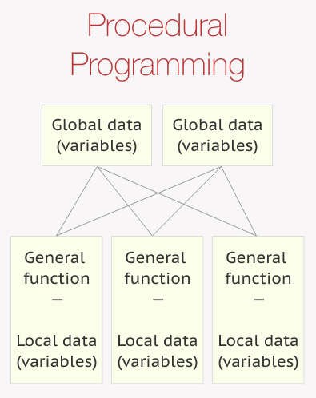
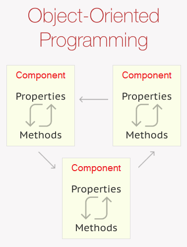
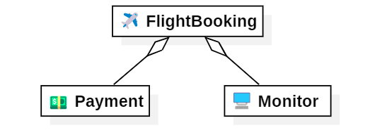
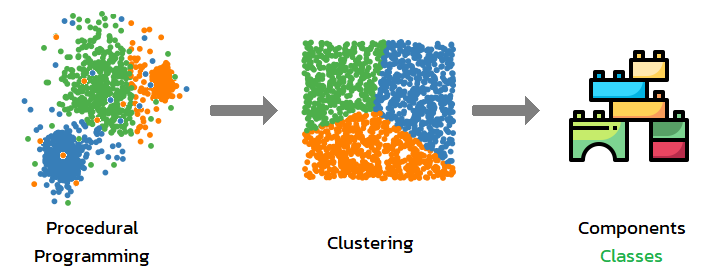
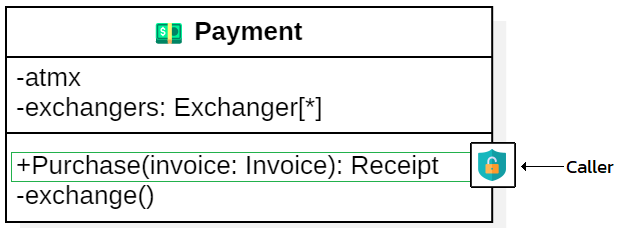
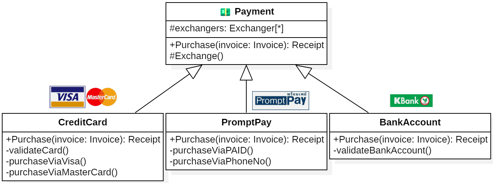
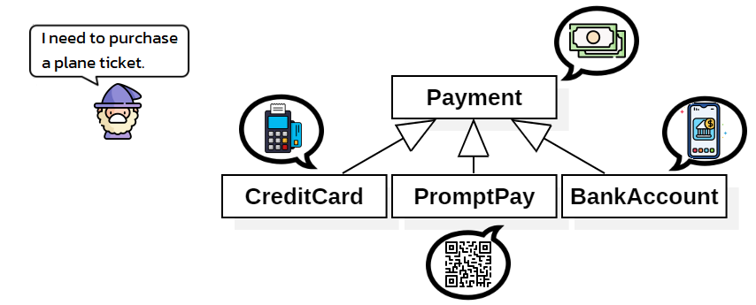
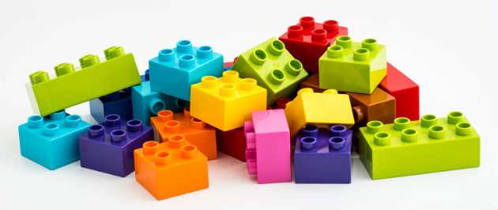

## Programming in the BIG picture
1. Fundamentals 👈
1. Solution design 👈
1. Specific problems
1. Facilitators & Tools

> 🧙‍♂️ For any programming languages

===

<!-- .slide: data-auto-animate data-auto-animate-id="oop" -->
## 🐣
## Object-Oriented Programming
1. Concept & Design
1. Interface
1. Abstract class

---

<!-- .slide: data-auto-animate data-auto-animate-id="oop" -->
## Object-Oriented Programming
Procedural Programming - Functions & Logics



---

<!-- .slide: data-auto-animate data-auto-animate-id="oop" -->
## Object-Oriented Programming
Procedural Programming - Functions & Logics
```csharp [0]
// ✈️ Flight Booking System
var availableFlights = GetAvailableFlight("Khonkaen", "Bangkok");
if (availableFlights.Length <= 0) return AlertFlightIsNotAvaiable();
ShowFligtDetail(availableFlights);
BookingInfo booking = ConfirmFlight(availableFlights);
if (null == booking) return null;
PurchaseInfo purchaseInfo = Purchase(booking);
if (false == purchaseInfo.IsSuccess) return ShowError(purchaseInfo);
return BookingAndPrintTicket(purchaseInfo);

FlightInfo[] GetAvailableFlight(string from, string to) { ... }
BookingResult AlertFlightIsNotAvaiable() { ... }
void ShowFligtDetail(FlightInfo[] flights) { ... }
BookingInfo ConfirmFlight(FlightInfo[] flights) { ... }
PurchaseInfo Purchase(BookingInfo booking) { ... }
BookingResult ShowError(PurchaseInfo purchaseInfo) { ... }
BookingResult BookingAndPrintTicket(PurchaseInfo purchaseInfo) { ... }
```
<!-- .element: style="width:100%" -->

---

<!-- .slide: data-auto-animate data-auto-animate-id="oop" -->
## Object-Oriented Programming
😭 It's hard to maintain

> 🧠 The human brain doesn't work like that
<!-- .element: style="width:80%" -->

---

<!-- .slide: data-auto-animate data-auto-animate-id="oop" -->
## Object-Oriented Programming
OOP - Components & Communications



---

<!-- .slide: data-auto-animate data-auto-animate-id="oop" -->
## Object-Oriented Programming
OOP - Components & Communications
```csharp [0]
// ✈️ Flight Booking System
var payment = new Payment();
var monitor = new Monitor();
var flightBooking = new FlightBooking(monitor, payment);
flightBooking.FindAvailableFlight("Khonkaen", "Bangkok");
return flightBooking.ConfirmFlight();

public class Payment { ... }        // 💵
public class Monitor { ... }        // 🖥️
public class FlightBooking { ... }  // ✈️
```
<!-- .element: style="width:100%" -->


---

<!-- .slide: data-auto-animate data-auto-animate-id="oop" -->
## Object-Oriented Programming
> 💖 Components & Communications



---

<!-- .slide: data-auto-animate data-auto-animate-id="oop" -->
## Object-Oriented Programming
> 💖 Components & Communications
1. Abstraction
1. Encapsulation
1. Inheritance
1. Polymorphism

😏 Just a design guideline

---

<!-- .slide: data-auto-animate data-auto-animate-id="oop" -->
## Object-Oriented Programming
1. Abstraction

```csharp
public class Payment { ... }        // 💵
public class Monitor { ... }        // 🖥️
public class FlightBooking { ... }  // ✈️
```
<!-- .element: style="width:60%" -->


🥷 Hiding the implementation details
```csharp
Console.WriteLine( arguments );
```
<!-- .element: style="width:45%" -->

---

<!-- .slide: data-auto-animate data-auto-animate-id="oop" -->
## Object-Oriented Programming
2. Encapsulation



💊 Hiding the internal state and functionality
```csharp
public, internal, protected, private
```
<!-- .element: style="width:50%" -->

---

<!-- .slide: data-auto-animate data-auto-animate-id="oop" -->
## Object-Oriented Programming
3. Inheritance



🧬 Extend and modify their behavior

---

<!-- .slide: data-auto-animate data-auto-animate-id="oop" -->
## Object-Oriented Programming
3. Inheritance

```csharp [0]
public class Payment                  // Base class  👩
{
    public void Purchase()
        => Console.WriteLine("Purchasing an order");
}

public class CreditCard : Payment {}  // Child class 👶
public class PromptPay : Payment {}   // Child class 👶
public class BankAccount : Payment {} // Child class 👶
```
<!-- .element: style="width:95%" -->
Child class gains all the methods, fields, properties, and events of the base class

---

<!-- .slide: data-auto-animate data-auto-animate-id="oop" -->
## Object-Oriented Programming
3. Inheritance

<font color="#5799d2">is-a</font> relationship (Inheritance)

```csharp
public class Payment {}               // Base class  👩
public class CreditCard : Payment {}  // Child class 👶
```
<!-- .element: style="width:80%" -->

<font color="#5799d2">has-a</font> relationship (Composition)

```csharp
public class ExchangerInfo {}
public class Payment
{
    public ExchangerInfo Exchange { get; set; } // has-a
}
```
<!-- .element: style="width:80%" -->

---

<!-- .slide: data-auto-animate data-auto-animate-id="oop" -->
## Object-Oriented Programming
3. Inheritance

<font color="#5799d2">is</font> keyword
```csharp
public class Payment {}               // Base class  👩
public class CreditCard : Payment {}  // Child class 👶
```
<!-- .element: style="width:80%" -->
```csharp [0]
CreditCard credit = new CreditCard();
if(credit is Payment payment)
{
    // ✅ true
}
```
<!-- .element: style="width:55%" -->
CreditCard is a Payment

---

<!-- .slide: data-auto-animate data-auto-animate-id="oop" -->
## Object-Oriented Programming
3. Inheritance

<font color="#5799d2">protected</font> keyword

```csharp [0]
public class Payment
{
    protected int Id { get; set; }  // 🔐 Only child
}

public class CreditCard : Payment
{
    public void Show()
        => Console.WriteLine(Id);   // ✅ Child class
}
```
<!-- .element: style="width:80%" -->
```csharp
CreditCard credit = new CreditCard();
credit.Id = 77;  // ❌ Error
```
<!-- .element: style="width:50%" -->

---

<!-- .slide: data-auto-animate data-auto-animate-id="oop" -->
## Object-Oriented Programming
3. Inheritance

<font color="#5799d2">sealed</font> keyword

```csharp [0]
public class Payment { }
public sealed class CreditCard : Payment { }
public class VisaCard : CreditCard { }   // ❌ Error
```
<!-- .element: style="width:75%" -->
😫 Goodbye cruel world

---

<!-- .slide: data-auto-animate data-auto-animate-id="oop" -->
## Object-Oriented Programming
4. Polymorphism



🥰 We treat your children equally

---

<!-- .slide: data-auto-animate data-auto-animate-id="oop" -->
## Object-Oriented Programming
4. Polymorphism

```csharp
public class Payment { }               // Base class  👩
public class CreditCard : Payment { }  // Child class 👶
public class PromptPay : Payment { }   // Child class 👶
public class BankAccount : Payment { } // Child class 👶
```
<!-- .element: style="width:80%" -->
```csharp [0]
Payment p1 = new Payment();
Payment p2 = new CreditCard();
Payment p3 = new PromptPay();
Payment p4 = new BankAccount();

void PurchaseTicket(Payment payment)
{
    // Purchasing
}
```
<!-- .element: style="width:55%" -->

---

<!-- .slide: data-auto-animate data-auto-animate-id="oop" -->
## Object-Oriented Programming
4. Polymorphism

<font color="#5799d2">virtual & override</font> keyword

```csharp
public class Payment
{
    public virtual void Purchase() => Console.WriteLine("Fiat");
}
public class CreditCard : Payment
{
    public override void Purchase() => Console.WriteLine("Credit card");
}
```
<!-- .element: style="width:100%" -->
```csharp [0]
Payment p1 = new Payment();
p1.Purchase();  // Output: Fiat

Payment p2 = new CreditCard();
p2.Purchase();  // Output: Credit card
```
<!-- .element: style="width:55%" -->

---

<!-- .slide: data-auto-animate data-auto-animate-id="oop" -->
## Object-Oriented Programming
4. Polymorphism

<font color="#5799d2">sealed</font> methods

```csharp [0]
public class Payment
{
    public virtual void Purchase() { }
}
public class CreditCard : Payment
{
    public sealed override void Purchase() { }
}
public class VisaCard : CreditCard
{
    public override void Purchase() { } // ❌ Error
}
```
<!-- .element: style="width:80%" -->
😫 Goodbye cruel world

---

<!-- .slide: data-auto-animate data-auto-animate-id="oop" -->
## Object-Oriented Programming
🎮 Challenge
```csharp [0]
public class Payment
{
    public virtual void Purchase() => Console.WriteLine("Fiat");
}
public class CreditCard : Payment
{
    public override void Purchase() => Console.WriteLine("Credit card");
}
public class PromptPay : Payment
{
    public void Purchase() => Console.WriteLine("QR code");
}
```
<!-- .element: style="width:105%" -->
```csharp [0]
Payment p1 = new Payment();     // 🤔 p1.Purchase(); ??
Payment p2 = new CreditCard();  // 🤔 p2.Purchase(); ??
Payment p3 = new PromptPay();   // 🤔 p3.Purchase(); ??
PromptPay p4 = new PromptPay(); // 🤔 p4.Purchase(); ??
```
<!-- .element: style="width:80%" -->

===

<!-- .slide: data-background="pink" -->
## 💖 Design Principles
### Composition over inheritance
> Classes should achieve polymorphic behavior and code reuse by their composition rather than inheritance from a base or parent class.

---

<!-- .slide: data-background="pink" -->
## 💖 Design Principles
### Separation of concerns
> Separating a computer program into distinct sections such that each section addresses a separate concern.

---

<!-- .slide: data-auto-animate data-auto-animate-id="oop" -->
## Object-Oriented Programming
> 💖 Components & Communications



===

<!-- .slide: data-auto-animate data-auto-animate-id="interface" -->
## Interface
😭 That is NOT what I expected

> 👨‍🦳: The requirements 🏠  
( 3 days laster )  
👷‍♂️: Here you go 🛖

---

<!-- .slide: data-auto-animate data-auto-animate-id="interface" -->
## Interface
😎 Contracts

> An interface defines a contract. Any class or struct that implements that contract must provide an implementation of the members defined in the interface. 

👨‍🦳 → Contract( 🏠 ) → 👷‍♂️ → 🏠

---

<!-- .slide: data-auto-animate data-auto-animate-id="interface" -->
## Interface
📜 Follow the code contracts
```csharp
// 🏠 Define a code contract
public interface IFlyable
{
    void Fly();
}
```
<!-- .element: style="width:70%" -->
```csharp
// 👷‍♂️ Provide implementations
public class Bird : IFlyable
{
    public void Fly()
        => Console.WriteLine("Bird is flying");
}
```
<!-- .element: style="width:70%" class="fragment" -->

---

<!-- .slide: data-auto-animate data-auto-animate-id="interface" -->
## Interface
📜📜📜 Multiple Interface Implementations
```csharp [0]
public interface IFlyable
{
    void Fly();
}
public interface IWalkable
{
    void Walk();
}
public interface ISwimmable
{
    void Swim();
}
public class Duck : IFlyable, IWalkable, ISwimmable
{
    public void Fly() => Console.WriteLine("Duck is flying");
    public void Walk() => Console.WriteLine("Duck is walking");
    public void Swim() => Console.WriteLine("Duck is swimming");
}
```
<!-- .element: style="width:95%" -->

---

<!-- .slide: data-auto-animate data-auto-animate-id="interface" -->
## Interface
Interface inheritance
```csharp
public interface IFlyable { }
public interface IWalkable { }
public interface ISwimmable { }
```
<!-- .element: style="width:45%" -->
```csharp
// 🤕 So painful
public class Duck : IFlyable, IWalkable, ISwimmable { }
public class Swan : IFlyable, IWalkable, ISwimmable { }
public class Goose : IFlyable, IWalkable, ISwimmable { }
public class ToeBiter : IFlyable, IWalkable, ISwimmable { }
public class WaterStrider : IFlyable, IWalkable, ISwimmable { }
```
<!-- .element: style="width:100%" -->

```csharp
public interface IFlyableAmphibia : IFlyable, IWalkable, ISwimmable { }
```
<!-- .element: style="width:100%" class="fragment" -->
```csharp
public class Duck : IFlyableAmphibia { }
public class Swan : IFlyableAmphibia { }
public class Goose : IFlyableAmphibia { }
public class ToeBiter : IFlyableAmphibia { }
public class WaterStrider : IFlyableAmphibia { }
```
<!-- .element: style="width:100%" class="fragment" -->

---

<!-- .slide: data-auto-animate data-auto-animate-id="interface" -->
## Interface
😎 Usage of Interface inheritance
```csharp
public interface IDeletableRepository { Task Delete(); }
public interface IQueryableRepository { IEnumerable<object> Query(); }
public interface IOperationalRepository { Task Upsert();  }
```
<!-- .element: style="width:100%" -->
```csharp [0]
public interface IRepository :
    IDeletableRepository
    IQueryableRepository,
    IOperationalRepository,
{
}
```
<!-- .element: style="width:100%" -->
```csharp [0]
public class SqlRepository : IRepository { ... }
public class MongoRepository : IRepository { ... }

IRepository repo = new SqlRepository();
IOperationalRepository operationalRepo = repo;
IQueryableRepository queryableRepo = repo;
IDeletableRepository deletableRepo = repo;
```
<!-- .element: style="width:75%" class="fragment" -->

---

<!-- .slide: data-background="pink" -->
## 💖 SOLID Design Principles
### Dependency-Inversion Principle
> High level modules should not depend on low level modules; both should depend on abstractions. Abstractions should not depend on details. Details should depend upon abstractions.

---

<!-- .slide: data-background="pink" -->
## 💖 SOLID Design Principles
### Dependency-Inversion Principle
😭 It's hard to change
```csharp
public class SqlRepository : IRepository { ... }
public class MongoRepository : IRepository { ... }

public class CoreModule {
    private SqlRepository database;
    public CoreModule(SqlRepository db) => database = db;
}
```
<!-- .element: style="width:85%" -->
```csharp
public class CoreModule {
    private IRepository repository;
    public CoreModule(IRepository repo) => repository = repo;
}
```
<!-- .element: style="width:85%" class="fragment" -->

---

<!-- .slide: data-auto-animate data-auto-animate-id="interface" -->
## Interface
😭 Same Same but Different
```csharp
public interface IMeleeWeapon { void Attack(); }
public interface IRangedWeapon { void Attack(); }
```
<!-- .element: style="width:85%" -->
```csharp
public class Gunblade : IMeleeWeapon, IRangedWeapon
{
    public void Attack() => Console.WriteLine("Attack");
}
```
<!-- .element: style="width:85%" -->
```csharp [0]
Gunblade gunblade = new Gunblade();
gunblade.Attack();  // Output: Attack

IMeleeWeapon melee = gunblade;
melee.Attack();     // Output: Attack

IRangedWeapon range = gunblade;
range.Attack();     // Output: Attack
```
<!-- .element: style="width:55%" class="fragment" -->

---

<!-- .slide: data-auto-animate data-auto-animate-id="interface" -->
## Interface
Explicit interface implementation
```csharp
public interface IMeleeWeapon { void Attack(); }
public interface IRangedWeapon { void Attack(); }
```
<!-- .element: style="width:85%" -->
```csharp
public class Gunblade : IMeleeWeapon, IRangedWeapon
{
    void IMeleeWeapon.Attack() => Console.WriteLine("Stab");
    void IRangedWeapon.Attack() => Console.WriteLine("Bang");
}
```
<!-- .element: style="width:85%" -->
```csharp [0]
Gunblade gunblade = new Gunblade();
gunblade.Attack();  // ❌ Error

IMeleeWeapon melee = gunblade;
melee.Attack();     // Output: Stab

IRangedWeapon range = gunblade;
range.Attack();     // Output: Bang
```
<!-- .element: style="width:55%" class="fragment" -->

---

<!-- .slide: data-auto-animate data-auto-animate-id="interface" -->
## Interface
🎮 Challenge
```csharp
public interface IMeleeWeapon { void Attack(); }
public interface IRangedWeapon { void Attack(); }
```
<!-- .element: style="width:85%" -->
```csharp
public class Gunblade : IMeleeWeapon, IRangedWeapon
{
    void IMeleeWeapon.Attack() => Console.WriteLine("Stab");
    void IRangedWeapon.Attack() => Console.WriteLine("Bang");
    public void Attack() => Console.WriteLine("Attack");
}
```
<!-- .element: style="width:85%" -->
```csharp [0]
Gunblade gunblade = new Gunblade();
gunblade.Attack();  // 🤔 ???

IMeleeWeapon melee = gunblade;
melee.Attack();     // 🤔 ???

IRangedWeapon range = gunblade;
range.Attack();     // 🤔 ???
```
<!-- .element: style="width:55%" -->

---

<!-- .slide: data-auto-animate data-auto-animate-id="interface" -->
## Interface
😭 You can't change it without side effect
```csharp
public interface IMeleeWeapon
{
    void Attack();
}

public class Sword : IMeleeWeapon
{
    public void Attack() => Console.WriteLine("Stab");
}
```
<!-- .element: style="width:75%" -->

---

<!-- .slide: data-auto-animate data-auto-animate-id="interface" -->
## Interface
😭 You can't change it without side effect
```csharp
public interface IMeleeWeapon
{
    void Attack();
    void Attack(string element);
}

public class Sword : IMeleeWeapon // ❌ Error
{
    public void Attack() => Console.WriteLine("Stab");
}
```
<!-- .element: style="width:75%" -->

---

<!-- .slide: data-auto-animate data-auto-animate-id="interface" -->
## Interface
😎 Default implementation
```csharp
public interface IMeleeWeapon
{
    void Attack();
    void Attack(string element) => Attack();
}

public class Sword : IMeleeWeapon
{
    public void Attack() => Console.WriteLine("Stab");
}
```
<!-- .element: style="width:75%" -->
```csharp [0]
Sword swordObj = new Sword();
swordObj.Attack();         // Output: Stab
swordObj.Attack("Ice");    // ❌ Error

IMeleeWeapon weaponObj = swordObj;
weaponObj.Attack();        // Output: Stab
weaponObj.Attack("Fire");  // Output: Stab
```
<!-- .element: style="width:65%" class="fragment" -->

---

<!-- .slide: data-auto-animate data-auto-animate-id="interface" -->
## Interface
😎 Default implementation
```csharp
public interface IMeleeWeapon {
    void Attack();
    void Attack(string element) => Attack();
}

public class Sword : IMeleeWeapon {
    public void Attack() => Console.WriteLine("Stab");
    public void Attack(string element)
        => Console.WriteLine($"Stab with {element} element");
}
```
<!-- .element: style="width:85%" -->
```csharp [0]
Sword swordObj = new Sword();
swordObj.Attack();         // Output: Stab
swordObj.Attack("Ice");    // Output: Stab with Ice element

IMeleeWeapon weaponObj = swordObj;
weaponObj.Attack();        // Output: Stab
weaponObj.Attack("Fire");  // Output: Stab with Fire element
```
<!-- .element: style="width:85%" class="fragment" -->

===

<!-- .slide: data-auto-animate data-auto-animate-id="abstract" -->
## Abstract class
😭 I can't decide

> 🐣 → 🐓🦃🐦🦅🦆🦢

```csharp
public class DataAccess
{
    public void Connect()
    {
        // 🤔 How ???
        // Sql, MySql, Mongo, Redis, ...
    }
}
```
<!-- .element: style="width:60%" -->

It depends on ...

---

<!-- .slide: data-auto-animate data-auto-animate-id="abstract" -->
## Abstract class
😎 Let your kids choose their lives

```csharp
public abstract class DataAccessBase
{
    public abstract void Connect();
}
```
<!-- .element: style="width:55%" -->
```csharp
public class SqlDataAccess : DataAccessBase
{
    public override void Connect()
        => Console.WriteLine("SQL connecting");
}

public class MongoDataAccess : DataAccessBase
{
    public override void Connect()
        => Console.WriteLine("Mongo connecting");
}
```
<!-- .element: style="width:70%" class="fragment" -->

---

<!-- .slide: data-auto-animate data-auto-animate-id="abstract" -->
## Abstract class
> The <font color="#5799d2">abstract</font> modifier indicates that the thing is incomplete implementation.
<!-- .element: style="width:100%" -->

1. It cannot be instantiated. <!-- .element: style="font-size:2rem" -->
1. Abstract method declarations are only permitted in abstract classes. <!-- .element: style="font-size:2rem" -->
1. A non-abstract class derived from an abstract class must implement all abstract methods. <!-- .element: style="font-size:2rem" -->
1. An abstract method is implicitly a virtual method. <!-- .element: style="font-size:2rem" -->
1. It is not possible to modify an abstract class with the sealed modifier. <!-- .element: style="font-size:2rem" -->

---

<!-- .slide: data-auto-animate data-auto-animate-id="abstract" -->
## Abstract class

```csharp
public abstract class DataAccessBase
{
    public bool Insert()
    {
        if (false == IsConnected) Connect();
        return BeginInsertNewRecord();
    }
    protected abstract bool IsConnected { get; set; }
    public abstract void Connect();
    protected abstract bool BeginInsertNewRecord();
}
```
<!-- .element: style="width:60%;font-size:1.1rem" -->
```csharp
public class SqlDataAccess : DataAccessBase
{
    protected override bool IsConnected { get; set; }
    public override void Connect()
    {
        Console.WriteLine("Connecting");
        IsConnected = true;
    }
    protected override bool BeginInsertNewRecord()
    {
        Console.WriteLine("Inserting");
        return true;
    }
}
```
<!-- .element: style="width:60%;font-size:1.1rem" -->

---

<!-- .slide: data-auto-animate data-auto-animate-id="abstract" -->
## Abstract class
Implement Interface
```csharp
public interface IRepository
{
    void Connect();
}

public abstract class DataAccessBase : IRepository
{
    public abstract void Connect();
}
```
<!-- .element: style="width:70%" -->
🤣 Que Sera, Sera Whatever Will Be, Will Be

---

<!-- .slide: data-auto-animate data-auto-animate-id="abstract" -->
## Abstract class
Implement Abstract
```csharp
public abstract class ConnectorBase
{
    public abstract void Connect();
}

public abstract class DataAccessBase : ConnectorBase
{
    public abstract void Insert();
}
```
<!-- .element: style="width:70%" -->
🤣 Que Sera, Sera Whatever Will Be, Will Be

---

<!-- .slide: data-auto-animate data-auto-animate-id="abstract" -->
## Abstract class
Abstract vs Interface

||Abstract class|Interface|
|--|--|--|
|Primary purpose|Shared implementation|Define a contract|
|Multiple inheritance|❌|✅|
|Limited implementation code|❌|✅|
<!-- .element: style="font-size:1.8rem" -->

===

# 🎮 Challenge
## ⚔️ MMO RPG
Players, NPCs, Jobs, Items, Monsters, Pets, Elements  
🧔‍♂️👨‍🦲👨‍🦱👩‍🦰👩‍🦳👶🕵️‍♂️🥷💂‍♂️👷‍♂️👨‍⚕️👩‍🌾👨‍🍳👩‍🚀🧑‍🚒🦸‍♂️🧙‍♂️🧛‍♀️💃🧚‍♂️🧛🧜‍♂️
🐣🐤😼🦁🐯🦊🦝🐮🐭🐺🐲🐊🐉🐫🦧🐆🐅🐐🦥🐘🦐🐠🐬🐳🐋🦞🐧
🎤🥁🪄🔮🎯🏒🏏🎾🏓⚽🪡💉🗡️🏹⚔️🪚🔫🪃🔦
🍟🍔🍕🍗🥩🍖🥠🍜🍚🍣🍧🍒🍼🔥💧🍃💩☀️🌞❤️💔💥💤💲🕒💱🚹🚺

===

## 🎉 Summary
1. Object-Oriented Programming
1. Interface
1. Abstract class
1. Principles
    1. Composition over inheritance
    1. Separation of concerns
    1. Dependency-Inversion