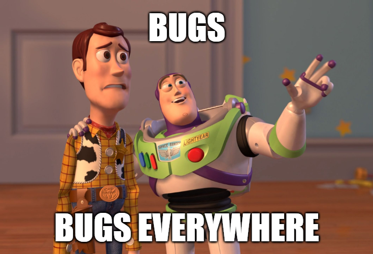
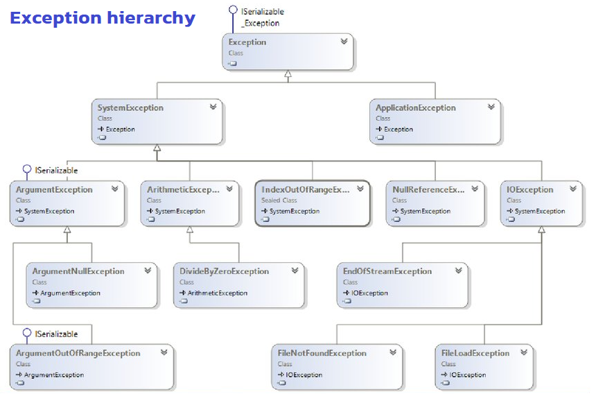
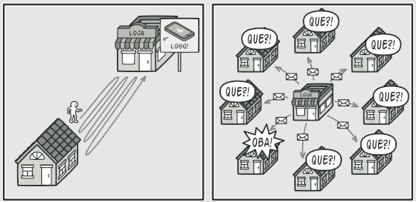
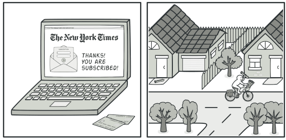
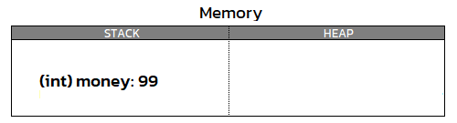
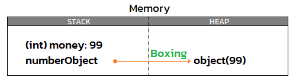
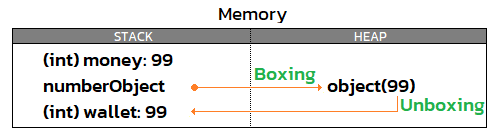

## Programming in the BIG picture
1. Fundamentals
1. Solution design 🥰
1. Specific problems 👈
1. Facilitators & Tools 👈

> 🧙‍♂️ For any programming languages

===

## 🪄
## Utilities( part1 );
1. Exception Handling 👈
1. Delegates
1. Events
1. Generics
1. Lambda expressions

---

<!-- .slide: data-auto-animate data-auto-animate-id="exception" -->
## Exception Handling
😭 Application crash


---

<!-- .slide: data-auto-animate data-auto-animate-id="exception" -->
## Exception Handling
😎 Using try-catch for preventing app from crashes 
```csharp
try
{
    // Code to try goes here.
}
catch
{
    // Code to handle the exception goes here.
}
```
<!-- .element: style="width:65%" -->

---

<!-- .slide: data-auto-animate data-auto-animate-id="exception" -->
## Exception Handling
😎 Using try-catch for preventing app from crashes 
```csharp
var input = 0;
try
{
    _ = 100 / input;
}
catch (DivideByZeroException ex)
{
    // Code to handle the exception goes here.
}
catch (ArithmeticException ex)
{
    // Code to handle the exception goes here.
}
catch (Exception ex)
{
    // Code to handle the exception goes here.
}
```
<!-- .element: style="width:65%" -->

---

<!-- .slide: data-auto-animate data-auto-animate-id="exception" -->
## Exception Handling


---

<!-- .slide: data-auto-animate data-auto-animate-id="exception" -->
## Exception Handling
try-catch-finally
```csharp
try
{
    // Code to try goes here.
}
catch (Exception ex)
{
    // Code to handle the exception goes here.
}
finally
{
    // Code to execute after try-catch goes here.
}
```
<!-- .element: style="width:70%" -->

---

<!-- .slide: data-auto-animate data-auto-animate-id="exception" -->
## Exception Handling
try-finally
```csharp
try
{
    object obj = "A";
    _ = (int)obj;
}
finally
{
    // Clean up any resources that are
	// allocated in the try block.
}
```
<!-- .element: style="width:70%" -->

---

<!-- .slide: data-auto-animate data-auto-animate-id="exception" -->
## Exception Handling
<font color="#5799d2">throw</font> keyword
```csharp
string input = null;
try
{
    _ = input.ToUpper();
}
catch (NullReferenceException ex)
{
    var msg = "Parameter Input is null.";
    throw new ArgumentNullException(msg, ex);
}
```
<!-- .element: style="width:70%" -->

---

<!-- .slide: data-auto-animate data-auto-animate-id="exception" -->
## Exception Handling
<font color="#5799d2">throw</font> keyword
```csharp
public class SqlDataAccess
{
    public string ConnString { get; }

    public SqlDataAccess(string connString)
    {
        ConnString = connString ?? 
			throw new ArgumentNullException(nameof(connString));
    }
}
```
<!-- .element: style="width:90%" -->

---

<!-- .slide: data-auto-animate data-auto-animate-id="exception" -->
## Exception Handling
Re-throwing an exception
```csharp
string input = null;
try
{
    _ = input.ToUpper();
}
catch (NullReferenceException ex)
{
    var msg = "Parameter Input is null.";
	Logger.Log(msg, ex);
    throw;
}
```
<!-- .element: style="width:70%" -->

---

<!-- .slide: data-auto-animate data-auto-animate-id="exception" -->
## Exception Handling
Implementing custom exceptions
```csharp
class SaladpukException : Exception
{
    public SaladpukException(string message)
    {
    }
}
```
<!-- .element: style="width:60%" -->
```csharp
try
{
    // Code to try goes here.
}
catch (SaladpukException ex)
{
    System.Console.WriteLine("A");
}
```
<!-- .element: style="width:60%" -->

---

<!-- .slide: data-auto-animate data-auto-animate-id="exception" -->
## Exception Handling
Things to Avoid When Throwing Exceptions
1. Don't use exceptions to change the flow of a program as part of ordinary execution. Use exceptions to report and handle error conditions. <!-- .element: style="font-size:1.8rem" -->
1. Exceptions shouldn't be returned as a return value or parameter instead of being thrown. <!-- .element: style="font-size:1.8rem" -->
1. Don't throw System.Exception, System.SystemException, System.NullReferenceException, or System.IndexOutOfRangeException intentionally from your own source code. <!-- .element: style="font-size:1.8rem" -->
1. Don't create exceptions that can be thrown in debug mode but not release mode. To identify run-time errors during the development phase, use Debug Assert instead. <!-- .element: style="font-size:1.8rem" -->

---

<!-- .slide: data-auto-animate data-auto-animate-id="exception" -->
## Exception Handling
🪲 Trace & Debug classes

> You can use these classes to provide information about the performance of an application either during application development, or after deployment to production.

🥰 [Logging in .NET Core](https://docs.microsoft.com/en-us/aspnet/core/fundamentals/logging/?view=aspnetcore-6.0)

---

<!-- .slide: data-auto-animate data-auto-animate-id="exception" -->
## Exception Handling
⚠️ Performance considerations
> Throwing or handling an exception consumes a significant amount of system resources and execution time.
<!-- .element: style="font-size:2rem" -->
```csharp
double Divide(double dividend, double divisor)
{
    if (dividend == 0) return double.NaN;
    return dividend / divisor;
}
```
<!-- .element: style="width:70%" -->

---

<!-- .slide: data-auto-animate data-auto-animate-id="exception" -->
## Exception Handling
📖 How to read error messages
```
Unhandled exception. System.InvalidOperationException: Operation is not valid due to the current state of the object.
   at ConsoleApp2.SqlDatabaseConnector.Connect() in D:\g\t3mp\ConsoleApp2\ConsoleApp2\Program.cs:line 23
   at ConsoleApp2.SqlDataAccess.Connect() in D:\g\t3mp\ConsoleApp2\ConsoleApp2\Program.cs:line 16
   at ConsoleApp2.Program.Main() in D:\g\t3mp\ConsoleApp2\ConsoleApp2\Program.cs:line 8
```
<!-- .element: style="width:100%" -->

===

## 🪄
## Utilities( part1 );
1. Exception Handling
1. Delegates 👈
1. Events
1. Generics
1. Lambda expressions

---

<!-- .slide: data-auto-animate data-auto-animate-id="delegate" -->
## Delegates
😭 I want something that can refer to a method
```csharp
public void MethodA()
{
    Console.WriteLine("Hi");
}
```
<!-- .element: style="width:40%" -->
```csharp
int money = 99;
string name = "Saladpuk";
??? myMethod = MethodA;
```
<!-- .element: style="width:40%" -->

---

<!-- .slide: data-auto-animate data-auto-animate-id="delegate" -->
## Delegates
😎 Delegate → Method()

```csharp
public void MethodA()
{
    Console.WriteLine("Hi");
}
```
<!-- .element: style="width:40%" -->
```csharp
delegate void DelegateName();
```
<!-- .element: style="width:40%" -->
```csharp
DelegateName del = MethodA;
del();         // Output: Hi
```
<!-- .element: style="width:40%" -->
```csharp
// 👍 Recommended
del.Invoke();  // Output: Hi
```
<!-- .element: style="width:40%" class="fragment" -->
```csharp
void SomeMethod(DelegateName callback) { }
```
<!-- .element: style="width:60%" class="fragment" -->

---

<!-- .slide: data-auto-animate data-auto-animate-id="delegate" -->
## Delegates
<font color="#5799d2">delegate</font> keyword

> A delegate is a type that holds a reference to a method that match its signature.
<!-- .element: style="font-size:1.8rem" -->

```csharp
// Declare its signature
delegate void DelegateName();
```
<!-- .element: style="width:40%" -->
```csharp
// ✅ Match
public void MethodA1() => Console.WriteLine("A");
protected void MethodA2() => Console.WriteLine("A");
internal void MethodA3() => Console.WriteLine("A");
private void MethodA4() => Console.WriteLine("A");

// ❌ Mismatch
public void MethodB(int p1) => Console.WriteLine("B");
public int MethodB() => Console.WriteLine("C");
public int MethodD(int p1) => Console.WriteLine("D");
```
<!-- .element: style="width:80%" -->

---

<!-- .slide: data-auto-animate data-auto-animate-id="delegate" -->
## Delegates
Multicast Delegate

> Delegates are multicast, which means that they can hold references to more than one event-handling method.
<!-- .element: style="width:80%;font-size:1.8rem" -->

```csharp
delegate void DelegateName();
```
<!-- .element: style="width:40%" -->
```csharp
void MethodA() => Console.WriteLine("A");
void MethodB() => Console.WriteLine("B");
void MethodC() => Console.WriteLine("C");
```
<!-- .element: style="width:60%" -->
```csharp
DelegateName del = MethodA;
del += MethodB;
del += MethodC;
del.Invoke(); // Output: A, B, C
```
<!-- .element: style="width:45%" -->

---

<!-- .slide: data-auto-animate data-auto-animate-id="delegate" -->
## Delegates
<font color="#5799d2">Actions</font> keyword (build-in Delegate)
> Encapsulates a method that has 0~16 parameters and does not return a value.
<!-- .element: style="font-size:1.8rem" -->
```csharp
void MethodA() => Console.WriteLine("A");
void MethodB(int p1) => Console.WriteLine("B");
void MethodC(int p1, string p2) => Console.WriteLine("C");
```
<!-- .element: style="width:80%" -->
```csharp
Action ac1 = MethodA;
ac1.Invoke();          // Output: A

Action<int> ac2 = MethodB;
ac2.Invoke(99);        // Output: B

Action<int, string> ac3 = MethodC;
ac3.Invoke(77, "Au");  // Output: C
```
<!-- .element: style="width:60%" -->

---

<!-- .slide: data-auto-animate data-auto-animate-id="delegate" -->
## Delegates
<font color="#5799d2">Funcs</font> keyword (build-in Delegate)

> Encapsulates a method that has 0~16 and returns a value of the type specified by the TResult parameter.
<!-- .element: style="font-size:1.8rem" -->
```csharp
int MethodA() => 1;
double MethodB(int p1) => 3.33;
string MethodC(int p1, string p2) => "C";
```
<!-- .element: style="width:80%" -->
```csharp
Func<int> ac1 = MethodA;
int result1 = ac1.Invoke();              // result1: 1

Func<int, double> ac2 = MethodB;
double result2 = ac2.Invoke(99);         // result2: 3.33

Func<int, string, string> ac3 = MethodC;
string result3 = ac3.Invoke(77, "Au");   // result3: "C"
```
<!-- .element: style="width:80%" -->

---

<!-- .slide: data-auto-animate data-auto-animate-id="delegate" -->
## Delegates
<font color="#5799d2">Predicate</font> keyword (build-in Delegate)

> Represents the method that defines a set of criteria and determines whether the specified object meets those criteria.
<!-- .element: style="font-size:1.8rem" -->
```csharp
bool MethodA(int p1) => p1 > 0;
```
<!-- .element: style="width:80%" -->
```csharp
Predicate<int> p = MethodA;
var result = p.Invoke(99);
Console.WriteLine(result);  // Output: true
```
<!-- .element: style="width:80%" -->

===

## 🪄
## Utilities( part1 );
1. Exception Handling
1. Delegates
1. Events 👈
1. Generics
1. Lambda expressions

---

<!-- .slide: data-auto-animate data-auto-animate-id="event" -->
## Events
😭 I missed the news


Visiting the store ⚔️ Sending spam

---

<!-- .slide: data-auto-animate data-auto-animate-id="event" -->
## Events
😎 [Observer Design Pattern](https://refactoring.guru/design-patterns/observer)


> Observer Pattern - lets you define a subscription mechanism to notify multiple objects about any events that happen to the object they’re observing.
<!-- .element: style="font-size:1.8rem" -->

---

<!-- .slide: data-auto-animate data-auto-animate-id="event" -->
## Events
### 🍿 Demo Observer Pattern

---

<!-- .slide: data-auto-animate data-auto-animate-id="event" -->
## Events
<font color="#5799d2">event</font> keyword

> An event is a message sent by an object to signal the occurrence of an action.
<!-- .element: style="font-size:1.8rem" -->

```csharp
public class YoutubeChannel
{
    public event EventHandler NewContentReleased;
}
```
<!-- .element: style="width:70%" -->
😋 EventHandler is a Delegate

```csharp
delegate void EventHandler(object? sender, EventArgs e)
```
<!-- .element: style="width:80%" -->

---

<!-- .slide: data-auto-animate data-auto-animate-id="event" -->
## Events
Event data

> Data that is associated with an event can be provided through an event data class. The [EventArgs](https://docs.microsoft.com/en-us/dotnet/api/system.eventargs?view=net-6.0) class is the base type for all event data classes.
<!-- .element: style="font-size:1.8rem" -->

```csharp
public class NewContentReleasedEventArgs : EventArgs
{
	public string Name { get; set; }
}
```
<!-- .element: style="width:70%" -->

---

<!-- .slide: data-auto-animate data-auto-animate-id="event" -->
## Events
Event handlers (Subscribe)

> To respond to an event, you define an event handler method in the event receiver. This method must match the signature of the delegate for the event you are handling.
<!-- .element: style="width:100%;font-size:1.6rem" -->

```csharp
public class YoutubeChannel
{
    public event EventHandler<NewContentReleasedEventArgs> NewContentReleased;
}
```
<!-- .element: style="width:105%" -->
```csharp
var saladpuk = new YoutubeChannel();
saladpuk.NewContentReleased += OnNewContentReleased;

void OnNewContentReleased(object? sender, NewContentReleasedEventArgs e)
{
    // Do something
}
```
<!-- .element: style="width:105%" -->

---

<!-- .slide: data-auto-animate data-auto-animate-id="event" -->
## Events
Unsubscribing

> In order to prevent resource leaks, you should unsubscribe from events before you dispose of a subscriber object.
<!-- .element: style="width:100%;font-size:1.6rem" -->

```csharp
var saladpuk = new YoutubeChannel();
saladpuk.NewContentReleased -= OnNewContentReleased;

void OnNewContentReleased(object? sender, NewContentReleasedEventArgs e)
{
    // Do something
}
```
<!-- .element: style="width:105%" -->
🤣 Don't forget to unsubscribe my channel

===

## 🪄
## Utilities( part1 );
1. Exception Handling
1. Delegates
1. Events
1. Generics 👈
1. Lambda expressions

---

<!-- .slide: data-auto-animate data-auto-animate-id="event" -->
## Generics
😭 How to make a class that suits every data type?
```csharp [0]
public class DumbStack
{
    private object[] collection = new object[10];
    private int currentIndex;

    public void Push(object data)
        => collection[currentIndex++] = data;

    public object Pop()
        => collection[--currentIndex];
}
```
<!-- .element: style="width:75%" -->
🤕 Poor performance for Boxing & Unboxing

---

<!-- .slide: data-auto-animate data-auto-animate-id="event" -->
## 💡Boxing & Unboxing
> **Boxing** is the process of converting a value type to the type object.  
**Unboxing** is an explicit conversion from the type object to a value type.  
⚠️ Boxing & Unboxing are computationally expensive processes.
<!-- .element: style="width:80%;font-size:1.6rem" -->

```csharp [0]
int money = 99;
object numberObject = money;     // Boxing
int wallet = (int)numberObject;  // Unboxing
```
<!-- .element: style="width:65%" -->
 <!-- .element: class="fragment" -->
 <!-- .element: class="fragment" -->
 <!-- .element: class="fragment" -->
<!-- .element: class="r-stack" -->

---

<!-- .slide: data-auto-animate data-auto-animate-id="event" -->
## Generics
> Generic makes it possible to defer the specification of types until the class or method is declared and instantiated by client code.
<!-- .element: style="width:100%;font-size:1.6rem" -->
```csharp [0]
public class DumbStack<T>
{
    private T[] collection = new T[10];
    private int currentIndex;

    public void Push(T data)
        => collection[currentIndex++] = data;

    public T Pop()
        => collection[--currentIndex];
} 
```
<!-- .element: style="width:70%" -->
```csharp
var numberStack = new DumbStack<int>();
numberStack.Push(99);
```
<!-- .element: style="width:55%" -->

---

<!-- .slide: data-auto-animate data-auto-animate-id="event" -->
## Generics
Generic Classes
```csharp [0]
public class DataRecord<T>
{
    public T Id { get; set; }
}

public class DataRecord<T, U>
{
    public T Id { get; set; }
    public U PaId { get; set; }
}
```
<!-- .element: style="width:55%" -->

```csharp
var rec1 = new DataRecord<int>();
rec1.Id = 1;

var rec2 = new DataRecord<string, string>();
rec2.Id = "record02";
rec2.PaId = "1234567890"
```
<!-- .element: style="width:65%" -->

---

<!-- .slide: data-auto-animate data-auto-animate-id="event" -->
## Generics
[Constraints on type parameters](https://docs.microsoft.com/en-us/dotnet/csharp/programming-guide/generics/constraints-on-type-parameters)
```csharp [0]
class Class1<T> where T : class { }
class Class2<T> where T : IDisposable { }
class Class3<T, U> where T : U { }
class Class4<T, U, V> where T : U where U : new() where V : struct { }
interface Contract1<T> where T : struct { }
```
<!-- .element: style="width:100%" -->

---

<!-- .slide: data-auto-animate data-auto-animate-id="event" -->
## Generics
Generic Methods
```csharp [0]
class Helper
{
    public void Print<T>(T value)
        => Console.WriteLine(value);

    public IEnumerable<int> Merge<T1, T2>(T1 coll1, T2 coll2)
        where T1 : IEnumerable<int>
        where T2 : IEnumerable<int>
        => coll1.Union(coll2);
}
```
<!-- .element: style="width:90%" -->
```csharp
var helper = new Helper();
helper.Print("A");      // Implicit
helper.Print<int>(99);  // Explicit
var arrayList = new int[] { 1, 2, 3 };
var listOfInt = new List<int> { 4, 5, 6 };
var result = helper.Merge(arrayList, listOfInt);
```
<!-- .element: style="width:70%" -->

---

<!-- .slide: data-auto-animate data-auto-animate-id="event" -->
## Generics
Generic & Inheritance
```csharp [0]
public class DataRecord<T>
{
    public T Id { get; set; }
}

public class UserDataRecord<T, U> : DataRecord<T>
{
    public U PaId { get; set; }
}
```
<!-- .element: style="width:70%" -->

---

<!-- .slide: data-auto-animate data-auto-animate-id="event" -->
## Generics
Generic Classes ⚔️ Generic Methods
```csharp [0]
// Generic Classes
public class DataRepository<T>
{
    public void Insert(T record) { }
}

// Generic Methods
public class DataRepository
{
    public void Insert<T>(T record) { }
}
```
<!-- .element: style="width:60%" -->

> Classes → Separate instance per entity  
> Methods → Comprehensive but so annoying 
<!-- .element: style="width:80%;font-size:2rem" -->

===

## 🪄
## Utilities( part1 );
1. Exception Handling
1. Delegates
1. Events
1. Generics
1. Lambda expressions 👈

---

<!-- .slide: data-auto-animate data-auto-animate-id="lambda" -->
## Lambda expressions
😭 I'm a lazy programmer


---

<!-- .slide: data-auto-animate data-auto-animate-id="lambda" -->
## Lambda expressions
😎 Anonymous functions

```csharp [0]
// 🥱 So boring
public void Print(string msg)
{
    Console.WriteLine(msg);
}

// 🦥 It's my way
public void Print(string msg)
    => Console.WriteLine(msg);
```
<!-- .element: style="width:60%" -->

---

<!-- .slide: data-auto-animate data-auto-animate-id="lambda" -->
## Lambda expressions
Expression lambda (Single statement)

> (parameters) => expression

```csharp
// Without parameters
void MethodA() => Console.WriteLine("A");
Action myAction = () => Console.WriteLine("action");
Func<bool> myFunc = () => true;

// With parameters
void MethodB(string name) => Console.WriteLine(name);
Action<int> myAction1 = (input1) => Console.WriteLine(input1);
Action<int> myAction2 = input1 => Console.WriteLine(input1);
Action<string, int> myAction3 = (p1, p2) => Console.WriteLine($"{p1} {p2}");
Func<int, int, int> myFunc = (p1, p2) => p1 + p2;
```
<!-- .element: style="width:105%" -->

---

<!-- .slide: data-auto-animate data-auto-animate-id="lambda" -->
## Lambda expressions
Statement lambda (Multiple statements)

> (parameters) => { statements };

```csharp [0]
Action<int> myAction1 = (p1) =>
{
    Console.WriteLine(p1);
    Console.WriteLine($"My {nameof(myAction1)}");
};
Action<int> myAction2 = p1 =>
{
    Console.WriteLine(p1);
    Console.WriteLine($"My {nameof(myAction2)}");
};
Action<string, int> myAction3 = (p1, p2) =>
{
    Console.WriteLine($"{p1 + p2}");
    Console.WriteLine($"My {nameof(myAction3)}");
};
```
<!-- .element: style="width:70%;font-size:1.3rem" -->

---

<!-- .slide: data-auto-animate data-auto-animate-id="lambda" -->
## Lambda expressions
Async lambdas

```csharp [0]
Action<int> longRunTask1 = async hr
    => await Task.Delay(TimeSpan.FromHours(hr));

Action<int, int, int> longRunTask2 = async (hr, min, sec) =>
{
    var delaytime = new TimeSpan(hr, min, sec);
    await Task.Delay(delaytime);
};
```
<!-- .element: style="width:90%" -->

---

<!-- .slide: data-auto-animate data-auto-animate-id="lambda" -->
## Lambda expressions
Lambda expressions and tuples

```csharp
Action<(int day, int month, int year)> print1 = date =>
{
    Console.WriteLine(date);
};

Action<(int day, int month, int year), (int hr, int min, int sec)> print2 = (date, time) =>
{
    var selectedDate = new DateTime(date.year, date.month, date.day);
    var selectedTime = new TimeSpan(time.hr, time.min, time.sec);
    selectedDate += selectedTime;
    Console.WriteLine(selectedDate);
};
```
<!-- .element: style="width:105%;font-size:1.2rem" -->
```csharp
print1((5, 9, 2022));              // Output: (5, 9, 2022)
print2((5, 9, 2022), (20, 0, 0));  // Output: 9/5/2022 8:00:00 PM
```
<!-- .element: style="width:75%;font-size:1.2rem" -->

---

<!-- .slide: data-auto-animate data-auto-animate-id="lambda" -->
## Lambda expressions
Lambdas with Event handler

```csharp
public class YoutubeChannel
{
    public event EventHandler NewContentReleased;
}
```
<!-- .element: style="width:70%" -->
```csharp
var saladpuk = new YoutubeChannel();
saladpuk.NewContentReleased += (sndr, se) => Console.WriteLine("News!");
```
<!-- .element: style="width:100%" -->

---

<!-- .slide: data-auto-animate data-auto-animate-id="lambda" -->
## Lambda expressions
Lambdas with LinQ

```csharp
var numbers = new[] { 1, 2, 3, 4, 5, 6, 7, 8 };
```
<!-- .element: style="width:70%" -->
```csharp
// 🥱 Boring
bool FilterEvenNumber(int number)
{
    return number % 2 == 0;
}

var qry1 = numbers.Where(FilterEvenNumber);
```
<!-- .element: style="width:70%" -->
```csharp
// 🦥 It's my way
var qry2 = numbers.Where(it => it % 2 == 0);
```
<!-- .element: style="width:70%" -->

---

<!-- .slide: data-auto-animate data-auto-animate-id="lambda" -->
## Lambda expressions
Implicit return type ⚔️ Explicit return type
```csharp
// Implicit return type
var function1 = (bool isRich) => isRich ? 5 : 100;
```
<!-- .element: style="width:105%" -->
```csharp
// Explicit return type
var function2 = (bool isNumber) => isNumber ? 10 : "Ten";        // ❌ Error
var function3 = object (bool isNumber) => isNumber ? 10 : "Ten"; // ✅
```
<!-- .element: style="width:105%" -->
```csharp
Console.WriteLine(function1(true));   // Output: 5
Console.WriteLine(function3(false));  // Output: Ten
```
<!-- .element: style="width:75%" -->

===

# 🎮 Challenge
## XO

===

## 🪄
## Utilities( part1 );
1. Exception Handling
1. Delegates 🎨
1. Events 🎨
1. Generics 🎨
1. Lambda expressions

> 🎨 DESIGN