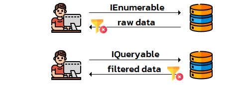
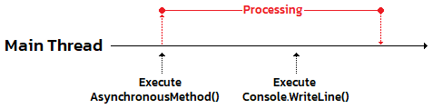
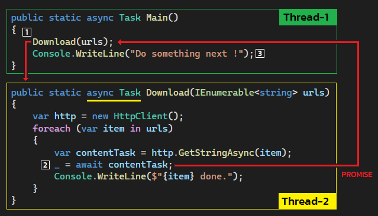

## Programming in the BIG picture
1. Fundamentals
1. Solution design 🥰
1. Specific problems 👈
1. Facilitators & Tools 👈

> 🧙‍♂️ For any programming languages

===

## 🪄
## Utilities( part2 );
1. Language Integrated Query (LINQ) 👈
1. Basic Asynchronous programming
1. Enumeration types
1. Attributes
1. What's next ?

---

<!-- .slide: data-auto-animate data-auto-animate-id="linq" -->
## Language Integrated Query
😭 I'm a lazy programmer

```csharp [0]
IEnumerable<int> GetPrimeNumbers(int targetNumber)
{
    for (var i = 2; i <= targetNumber; i++)
    {
        var isPrime = true;
        for (var j = 2; j * j <= i; j++)
        {
            if (i % j == 0)
            {
                isPrime = false;
                break;
            }
        }
        if (isPrime)
        {
            yield return i;
        }
    }
}
```
<!-- .element: style="width:65%;font-size:1.3rem" -->

---

<!-- .slide: data-auto-animate data-auto-animate-id="linq" -->
## Language Integrated Query
😎 Using LinQ
```csharp [0]
IEnumerable<int> GetPrimeNumbers(int targetNumber)
    => Enumerable.Range(2, targetNumber - 1)
    .Where(runNo => !Enumerable.Range(2, runNo)
        .Where(it => it * it <= runNo)
        .Any(it => runNo % it == 0));
```
<!-- .element: style="width:65%;font-size:1.3rem" -->
```csharp
foreach (var item in GetPrimeNumbers(101))
{
    Console.WriteLine(item);
}
// Output:
// 2, 3, 5, 7, 11, 13, 17, 19, 23, 29, 31, 37, 41, 43
// 47, 53, 59, 61, 67, 71, 73, 79, 83, 89, 97, 101
```
<!-- .element: style="width:65%;font-size:1.3rem" -->

---

<!-- .slide: data-auto-animate data-auto-animate-id="linq" -->
## Language Integrated Query
> LINQ can be used to query and to transform data from any collection of objects that supports IEnumerable or the generic IEnumerable<T> interface.
<!-- .element: style="width:60%;font-size:1.3rem" -->

```csharp [0]
public interface IEnumerable
{
    IEnumerator GetEnumerator();
}

public interface IEnumerable<T> : IEnumerable
{
    IEnumerator<T> GetEnumerator();
}

public interface IQueryable : IEnumerable
{
    Type ElementType { get; }
    Expression Expression { get; }
    IQueryProvider Provider { get; }
}
```
<!-- .element: style="width:70%;font-size:1.3rem" -->

---

<!-- .slide: data-auto-animate data-auto-animate-id="linq" -->
## Language Integrated Query
|Group|Methods|
|--|--|
|[Sorting](https://docs.microsoft.com/en-us/dotnet/csharp/programming-guide/concepts/linq/sorting-data)|OrderBy, OrderByDescending, ThenBy, ThenByDescending, Reverse|
|[Set](https://docs.microsoft.com/en-us/dotnet/csharp/programming-guide/concepts/linq/set-operations)|Distinct, Except, Intersect, Union|
|[Filtering](https://docs.microsoft.com/en-us/dotnet/csharp/programming-guide/concepts/linq/filtering-data)|OfType, Where|
|[Quantifier](https://docs.microsoft.com/en-us/dotnet/csharp/programming-guide/concepts/linq/quantifier-operations)|All, Any, Contains|
|[Projection](https://docs.microsoft.com/en-us/dotnet/csharp/programming-guide/concepts/linq/projection-operations)|Select, SelectMany, Zip|
|[Partitioning](https://docs.microsoft.com/en-us/dotnet/csharp/programming-guide/concepts/linq/partitioning-data)|Skip, SkipWhile, Take, TakeWhile, Chunk|
|[Join](https://docs.microsoft.com/en-us/dotnet/csharp/programming-guide/concepts/linq/join-operations)|Join, GroupJoin|
|[Grouping](https://docs.microsoft.com/en-us/dotnet/csharp/programming-guide/concepts/linq/grouping-data)|GroupBy, ToLookup|
|[Generation](https://docs.microsoft.com/en-us/dotnet/csharp/programming-guide/concepts/linq/generation-operations)|DefaultIfEmpty, Empty, Range, Repeat|
|[Equality](https://docs.microsoft.com/en-us/dotnet/csharp/programming-guide/concepts/linq/equality-operations)|SequenceEqual|
|[Element](https://docs.microsoft.com/en-us/dotnet/csharp/programming-guide/concepts/linq/element-operations)|ElementAt, ElementAtOrDefault, First, FirstOrDefault, Last, LastOrDefault, Single, SingleOrDefault|
|[Converting](https://docs.microsoft.com/en-us/dotnet/csharp/programming-guide/concepts/linq/converting-data-types)|AsEnumerable, AsQueryable, Cast, OfType, ToArray, ToDictionary, ToList, ToLookup|
|[Concatenation](https://docs.microsoft.com/en-us/dotnet/csharp/programming-guide/concepts/linq/concatenation-operations)|Concat|
|[Aggregation](https://docs.microsoft.com/en-us/dotnet/csharp/programming-guide/concepts/linq/aggregation-operations)|Aggregate, Average, Count, LongCount, Max, Min, Sum|
<!-- .element: style="width:100%;font-size:1.3rem" -->

---

<!-- .slide: data-auto-animate data-auto-animate-id="linq" -->
## Language Integrated Query
Query Syntax ⚔️ Method Syntax

```csharp
// Query Syntax
var qry1 = from number in Enumerable.Range(1, 100)
           where number % 2 == 0
           select number;

// Method Syntax
var qry2 = Enumerable.Range(1, 100)
    .Where(it => it % 2 == 0);
```
<!-- .element: style="width:70%" -->

>  The query syntax must be translated into method calls for the .NET common language runtime (CLR) when the code is compiled.
<!-- .element: style="width:70%;font-size:1.5rem" -->

---

<!-- .slide: data-auto-animate data-auto-animate-id="linq" -->
## Language Integrated Query
Composability of Queries (Chainable)

```csharp [0]
var numbers = new[] { 6, 3, 1, 8, 4, 9, 2, 5, 0, 7 };

// Query Syntax
var qry1 = from number in numbers
           where number % 2 == 0
           orderby number
           select number;

// Method Syntax
var qry2 = numbers
    .Where(it => it % 2 == 0)
    .OrderBy(it => it);
```
<!-- .element: style="width:80%" -->

😎 Queries are returned to an IEnumerable

---

<!-- .slide: data-auto-animate data-auto-animate-id="linq" -->
## Language Integrated Query
Three Parts of a Query Operation

1. Obtain the data source
1. Create the query
1. Execute the query

```csharp
// 1. Data source.
var dataSource = Enumerable.Range(1, 100);

// 2. Query creation.
var evenQuery = dataSource.Where(it => it % 2 == 0);

// 3. Query execution.
foreach (var item in evenQuery)
{
    Console.WriteLine(item);  // Output: 2, 4, ..., 100
}
```
<!-- .element: style="width:80%" -->

---

<!-- .slide: data-auto-animate data-auto-animate-id="linq" -->
## Language Integrated Query
🎆 Manner of Execution

1. Immediate - the data source is read and the operation is performed once. All the standard query operators that return a scalar result execute immediately.
<!-- .element: style="font-size:2rem" -->
1. Deferred - the operation is not performed at the point in the code where the query is declared. The operation is performed only when the query variable is enumerated.
<!-- .element: style="font-size:2rem" -->

---

<!-- .slide: data-auto-animate data-auto-animate-id="linq" -->
## Language Integrated Query
🚀 Immediate Execution

```csharp
var executionCounter = 0;

// 1. Data source.
var dataSource = Enumerable.Range(1, 100);

// 2. Query creation.
var evenNumbers = dataSource.Where(it =>
{
    executionCounter++;
    return it % 2 == 0;
}).ToList();

Console.WriteLine(executionCounter); // Output: 100
```
<!-- .element: style="width:60%;font-size:1.2rem" -->
```csharp
// 3. Query execution.
foreach (var item in evenNumbers)
{
    Console.WriteLine(item);
}

Console.WriteLine(executionCounter); // Output: 100
```
<!-- .element: style="width:60%;font-size:1.2rem" class="fragment" -->

---

<!-- .slide: data-auto-animate data-auto-animate-id="linq" -->
## Language Integrated Query
🦥 Deferred Execution

```csharp
var executionCounter = 0;

// 1. Data source.
var dataSource = Enumerable.Range(1, 100);

// 2. Query creation.
var evenQuery = dataSource.Where(it =>
{
    executionCounter++;
    return it % 2 == 0;
});

Console.WriteLine(executionCounter); // Output: 0
```
<!-- .element: style="width:60%;font-size:1.2rem" -->
```csharp
// 3. Query execution.
foreach (var item in evenQuery)
{
    Console.WriteLine(item);
}

Console.WriteLine(executionCounter); // Output: 100
```
<!-- .element: style="width:60%;font-size:1.2rem" class="fragment" -->

---

<!-- .slide: data-auto-animate data-auto-animate-id="linq" -->
## Language Integrated Query
🎮 Challenge 1

```csharp [0]
var executionCounter = 0;

var dataSource = Enumerable.Range(1, 100);
var evenNumbers = dataSource.Where(it =>
{
    executionCounter++;
    return it % 2 == 0;
});
var twiceNumbers = evenNumbers.Select(it =>
{
    executionCounter++;
    return it * 2;
});

Console.WriteLine(executionCounter);      // Output: 🤔 ???

Console.WriteLine(evenNumbers.Sum());     // Output: 2550
Console.WriteLine(evenNumbers.Average()); // Output: 51
Console.WriteLine(evenNumbers.Max());     // Output: 100
Console.WriteLine(evenNumbers.Min());     // Output: 2
Console.WriteLine(twiceNumbers.Sum());    // Output: 5100

Console.WriteLine(executionCounter);      // Output: 🤔 ???
```
<!-- .element: style="width:70%;font-size:1.15rem" -->

---

<!-- .slide: data-auto-animate data-auto-animate-id="linq" -->
## Language Integrated Query
🎮 Challenge 2

```csharp [0]
var executionCounter = 0;

var dataSource = Enumerable.Range(1, 100);
var evenNumbers = dataSource.Where(it =>
{
    executionCounter++;
    return it % 2 == 0;
}).ToList();
var twiceNumbers = evenNumbers.Select(it =>
{
    executionCounter++;
    return it * 2;
});

Console.WriteLine(executionCounter);      // Output: 🤔 ???

Console.WriteLine(evenNumbers.Sum());     // Output: 2550
Console.WriteLine(evenNumbers.Average()); // Output: 51
Console.WriteLine(evenNumbers.Max());     // Output: 100
Console.WriteLine(evenNumbers.Min());     // Output: 2
Console.WriteLine(twiceNumbers.Sum());    // Output: 5100

Console.WriteLine(executionCounter);      // Output: 🤔 ???
```
<!-- .element: style="width:70%;font-size:1.15rem" -->

---

<!-- .slide: data-auto-animate data-auto-animate-id="linq" -->
## Language Integrated Query
🎮 Challenge 3

```csharp [0]
var executionCounter = 0;

var dataSource = Enumerable.Range(1, 100);
var evenNumbers = dataSource.Where(it =>
{
    executionCounter++;
    return it % 2 == 0;
});
var twiceNumbers = evenNumbers.Select(it =>
{
    executionCounter++;
    return it * 2;
}).ToList();

Console.WriteLine(executionCounter);      // Output: 🤔 ???

Console.WriteLine(evenNumbers.Sum());     // Output: 2550
Console.WriteLine(evenNumbers.Average()); // Output: 51
Console.WriteLine(evenNumbers.Max());     // Output: 100
Console.WriteLine(evenNumbers.Min());     // Output: 2
Console.WriteLine(twiceNumbers.Sum());    // Output: 5100

Console.WriteLine(executionCounter);      // Output: 🤔 ???
```
<!-- .element: style="width:70%;font-size:1.15rem" -->

---

<!-- .slide: data-auto-animate data-auto-animate-id="linq" -->
## Language Integrated Query
🦥 Two types of Deferred execution

1. Streaming - operators do not have to read all the source data before they yield elements. 
1. Non-Streaming - operators must read all the source data before they can yield a result element.

[Classification Table](https://docs.microsoft.com/en-us/dotnet/csharp/programming-guide/concepts/linq/classification-of-standard-query-operators-by-manner-of-execution#classification-table)

---

<!-- .slide: data-auto-animate data-auto-animate-id="linq" -->
## Language Integrated Query
🔑 Standard Query Operators

> There are two sets of LINQ standard query operators IEnumerable<T> and IQueryable<T>.
<!-- .element: style="width:80%;font-size:1.3rem" -->

1. [IEnumerable](https://docs.microsoft.com/en-us/dotnet/api/system.linq.enumerable?view=net-6.0) → queries on in-memory collections.
<!-- .element: style="font-size:2rem" -->
1. [IQueryable](https://docs.microsoft.com/en-us/dotnet/api/system.linq.queryable?view=net-6.0) → queries processing is handled by the source object.
<!-- .element: style="font-size:2rem" -->



===

## 🪄
## Utilities( part2 );
1. Language Integrated Query (LINQ)
1. Basic Asynchronous programming 👈
1. Enumeration types
1. Attributes
1. What's next ?

---

<!-- .slide: data-auto-animate data-auto-animate-id="async" -->
## Asynchronous programming
😭 Application is not responding


😢 Even I have i9-12900KS 8C/16T

---

<!-- .slide: data-auto-animate data-auto-animate-id="async" -->
## Asynchronous programming
🤔 What is the root cause of it ?


<!-- .element: class="fragment" -->
<!-- .element: class="fragment" -->
<!-- .element: class="r-stack" -->

---

<!-- .slide: data-auto-animate data-auto-animate-id="async" -->
## Asynchronous programming
## 🍿 DEMO

---

<!-- .slide: data-auto-animate data-auto-animate-id="async" -->
## Asynchronous programming
Synchronous vs Asynchronous


---

<!-- .slide: data-auto-animate data-auto-animate-id="async" -->
## Asynchronous programming
Synchronous processing

```csharp [0]
public void Download(IEnumerable<string> urls)
{
    var http = new HttpClient();
    foreach (var item in urls)
    {
        var contentTask = http.GetStringAsync(item);
        _ = contentTask.Result;
        Console.WriteLine($"{item} done.");
    }
}
```
<!-- .element: style="width:75%;" -->
```csharp
Download(urls);
Console.WriteLine("Do something next !");
```
<!-- .element: style="width:75%;" -->
```csharp
IEnumerable<string> urls = new[]
{
    "https://docs.microsoft.com", "https://docs.microsoft.com/aspnet/core", "https://docs.microsoft.com/azure", "https://docs.microsoft.com/azure/devops",
    "https://docs.microsoft.com/dotnet", "https://docs.microsoft.com/dynamics365", "https://docs.microsoft.com/education", "https://docs.microsoft.com/sql", 
    "https://docs.microsoft.com/gaming", "https://docs.microsoft.com/graph", "https://docs.microsoft.com/xamarin", "https://docs.microsoft.com/windows",
    "https://docs.microsoft.com/windows", "https://docs.microsoft.com/office", "https://docs.microsoft.com/powershell", "https://docs.microsoft.com/surface",
    "https://docs.microsoft.com/enterprise-mobility-security", "https://docs.microsoft.com/system-center", "https://docs.microsoft.com/microsoft-365",
};
```
<!-- .element: style="width:75%;font-size:0.5rem" -->

---

<!-- .slide: data-auto-animate data-auto-animate-id="async" -->
## Asynchronous programming
Asynchronous processing

```csharp [0]
public async Task Download(IEnumerable<string> urls)
{
    var http = new HttpClient();
    foreach (var item in urls)
    {
        var contentTask = http.GetStringAsync(item);
        _ = await contentTask;
        Console.WriteLine($"{item} done.");
    }
}
```
<!-- .element: style="width:75%;" -->
```csharp
Download(urls);
Console.WriteLine("Do something next !");
```
<!-- .element: style="width:75%;" -->
```csharp
IEnumerable<string> urls = new[]
{
    "https://docs.microsoft.com", "https://docs.microsoft.com/aspnet/core", "https://docs.microsoft.com/azure", "https://docs.microsoft.com/azure/devops",
    "https://docs.microsoft.com/dotnet", "https://docs.microsoft.com/dynamics365", "https://docs.microsoft.com/education", "https://docs.microsoft.com/sql", 
    "https://docs.microsoft.com/gaming", "https://docs.microsoft.com/graph", "https://docs.microsoft.com/xamarin", "https://docs.microsoft.com/windows",
    "https://docs.microsoft.com/windows", "https://docs.microsoft.com/office", "https://docs.microsoft.com/powershell", "https://docs.microsoft.com/surface",
    "https://docs.microsoft.com/enterprise-mobility-security", "https://docs.microsoft.com/system-center", "https://docs.microsoft.com/microsoft-365",
};
```
<!-- .element: style="width:75%;font-size:0.5rem" -->

---

<!-- .slide: data-auto-animate data-auto-animate-id="async" -->
## Asynchronous programming
Asynchronous processing

<font color="#5799d2">async</font> - <font color="#5799d2">Task</font> - <font color="#5799d2">await</font> keywords

```csharp [0]
public async Task Download(IEnumerable<string> urls)
{
    var http = new HttpClient();
    foreach (var item in urls)
    {
        var contentTask = http.GetStringAsync(item);
        _ = await contentTask;
        Console.WriteLine($"{item} done.");
    }
}
```
<!-- .element: style="width:75%;" -->


---

<!-- .slide: data-auto-animate data-auto-animate-id="async" -->
## Asynchronous programming
Asynchronous processing

<font color="#5799d2">async</font> - <font color="#5799d2">Task</font> - <font color="#5799d2">await</font> keywords



---

<!-- .slide: data-auto-animate data-auto-animate-id="async" -->
## Asynchronous programming
## 🍿 DEMO 2

---

<!-- .slide: data-auto-animate data-auto-animate-id="async" -->
## Asynchronous programming
Task ⚔️ Task<T>

```csharp
public static async Task Download()
{
    var http = new HttpClient();
    _ = await http.GetStringAsync("https://docs.microsoft.com");
}

public static async Task<string> Download()
{
    var http = new HttpClient();
    return await http.GetStringAsync("https://docs.microsoft.com");
}
```
<!-- .element: style="width:96%;" -->

---

<!-- .slide: data-auto-animate data-auto-animate-id="async" -->
## Asynchronous programming
Asynchronous processing

<font color="#5799d2">async</font> - <font color="#5799d2">void</font> keywords

```csharp [0]
public async void Download(IEnumerable<string> urls)
    => throw new NotImplementedException("Lazy");
```
<!-- .element: style="width:75%;" -->
> ⚠️ event only

---

<!-- .slide: data-auto-animate data-auto-animate-id="async" -->
## Asynchronous programming
ContinueWith();

```csharp [0]
public static async Task Main()
{
    await Download(urls)
        .ContinueWith(it =>
        {
            Console.WriteLine("Do 1");
        })
        .ContinueWith(it =>
        {
            Console.WriteLine("Do 2");
        })
        .ContinueWith(it =>
        {
            Console.WriteLine("Do 3");
        });
    Console.WriteLine("Do something next !");
}
```
<!-- .element: style="width:70%;" -->

---

<!-- .slide: data-auto-animate data-auto-animate-id="async" -->
## Asynchronous programming
I/O-bound vs CPU-bound

 1. I/O - such as requesting data from a network, accessing a database, or reading and writing to a file system.
 1. CPU-bound - performing an expensive calculation.

---

<!-- .slide: data-auto-animate data-auto-animate-id="async" -->
## Asynchronous programming
Recognize CPU-bound and I/O-bound work

* I/O-bound → use async and await without Task.Run
* CPU-bound →  use async and await, but spawn off the work on another thread with Task.Run

---

<!-- .slide: data-auto-animate data-auto-animate-id="async" -->
## Asynchronous programming
CPU-bound → Task.Run();

```csharp
public static async Task Main()
{
    var task = Task.Run(() => Download(urls));
    await task;
    Console.WriteLine("Do something next !");
}

public static void Download(IEnumerable<string> urls)
{
    var http = new HttpClient();
    foreach (var item in urls)
    {
        var contentTask = http.GetStringAsync(item);
        _ = contentTask.Result;
        Console.WriteLine($"{item} done.");
    }
}
```
<!-- .element: style="width:75%" -->

---

<!-- .slide: data-auto-animate data-auto-animate-id="async" -->
## Asynchronous programming
Cancel Tasks

> CancellationTokenSource - for cancel an async console application if you don't want to wait for it to finish.
<!-- .element: style="width:70%;font-size:1.3rem" -->

```csharp
async Task DownloadAsync(string url, CancellationToken token)
    => await new HttpClient().GetStringAsync(url, token);
```
<!-- .element: style="width:90%" -->
```csharp
var src = new CancellationTokenSource();
CancellationToken token = src.Token;
await DownloadAsync("https://docs.microsoft.com", token);
src.Cancel();  // Cancel the task
```
<!-- .element: style="width:80%" -->
```csharp
if (token.IsCancellationRequested) // Validate the token
{
    // Do something
}
```
<!-- .element: style="width:80%" -->

---

<!-- .slide: data-auto-animate data-auto-animate-id="async" -->
## Asynchronous programming
ContinueWith();

```csharp [0]
var cancellation = new CancellationTokenSource();
var token = cancellation.Token;
await Download(urls, token)
    .ContinueWith(it =>
    {
        // Success or Cancel
        Console.WriteLine("Do 1");
    }, TaskContinuationOptions.OnlyOnRanToCompletion)
    .ContinueWith(it =>
    {
        // Fail
        Console.WriteLine("Do 2");
    }, TaskContinuationOptions.OnlyOnFaulted)
    .ContinueWith(it =>
    {
        // Cancel
        Console.WriteLine("Do 3");
    }, TaskContinuationOptions.OnlyOnCanceled);
```
<!-- .element: style="width:80%" -->

---

<!-- .slide: data-auto-animate data-auto-animate-id="async" -->
## Asynchronous programming
1. async + Task + await <!-- .element: style="font-size:2rem" -->
1. async + Task → Synchronous <!-- .element: style="font-size:2rem" -->
1. async + void → event <!-- .element: style="font-size:2rem" -->
1. async + await vs ContinueWith() <!-- .element: style="font-size:2rem" -->
1. Don't block the main thread <!-- .element: style="font-size:2rem" -->
1. Write less stateful code <!-- .element: style="font-size:2rem" -->

===

## 🪄
## Utilities( part2 );
1. Language Integrated Query (LINQ)
1. Basic Asynchronous programming
1. Enumeration types 👈
1. Attributes
1. What's next ?

---

<!-- .slide: data-auto-animate data-auto-animate-id="enum" -->
## Enumeration types
😭 I can't remember anything

```csharp
var numbers = new[]
{ 
    0, 1, 2, 3, 4, 5, 6, 7 
};
var dayOfWeek = new[]
{
    "Sun", "Mon", "Tue", "Wen", "Thu", "Fri", "Sat"
};
var mapTable = numbers.Zip(dayOfWeek);
foreach (var item in mapTable)
{
    Console.WriteLine(item);
}

// Output
// (0, Sun), (1, Mon), (2, Tue), (3, Wen)
// (4, Thu), (5, Fri), (6, Sat)
```
<!-- .element: style="width:70%" -->

---

<!-- .slide: data-auto-animate data-auto-animate-id="enum" -->
## Enumeration types
😎 Easy to remember huh?

```csharp
public enum DayOfWeek
{
    Sunday,
    Monday,
    Tuesday,
    Wednesday,
    Thursday,
    Friday,
    Saturday,
}
```
<!-- .element: style="width:30%" -->

```csharp
var today = DayOfWeek.Monday;

if (today != DayOfWeek.Friday)
{
    // Do something
}
```
<!-- .element: style="width:45%" -->

---

<!-- .slide: data-auto-animate data-auto-animate-id="enum" -->
## Enumeration types
Under the hood

> Enum is a set of named constants of the underlying integral numeric type

```csharp
public enum DayOfWeek
{
    Sunday = 0,
    Monday = 1,
    Tuesday = 2,
    Wednesday = 3,
    Thursday = 4,
    Friday = 5,
    Saturday = 6,
}
```
<!-- .element: style="width:40%" -->

---

<!-- .slide: data-auto-animate data-auto-animate-id="enum" -->
## Enumeration types
Conversions

```csharp
// Enum → Number
int dayAsNumber = (int)DayOfWeek.Monday;
Console.WriteLine(dayAsNumber); // Output: 1

// Number → Enum
DayOfWeek dayAsEnum = (DayOfWeek)3;
Console.WriteLine(dayAsEnum);   // Output: Wednesday

// Enum → String
string dayAsString = DayOfWeek.Thursday.ToString();
Console.WriteLine(dayAsString); // Output: Thursday

// String → Enum
Enum.TryParse<DayOfWeek>("sUndaY", out dayAsEnum);
Console.WriteLine(dayAsEnum);  // Output: Sunday

// Mismatch case
DayOfWeek mismatch = (DayOfWeek)99;
Console.WriteLine(mismatch);   // Output: 99
```
<!-- .element: style="width:60%;font-size:1.15rem" -->
```csharp
// 🤔 Challenge
DayOfWeek initDay = default;
Console.WriteLine(initDay);   // Output: ???
```
<!-- .element: style="width:60%;font-size:1.15rem" -->

---

<!-- .slide: data-auto-animate data-auto-animate-id="enum" -->
## Enumeration types
😎 Switch lover

```csharp
var day = DayOfWeek.Monday;
switch (day)
{
    case DayOfWeek.None: break;
    case DayOfWeek.Monday: break;
    case DayOfWeek.Tuesday: break;
    case DayOfWeek.Wednesday: break;
    case DayOfWeek.Thursday: break;
    case DayOfWeek.Friday: break;
    case DayOfWeek.Saturday: break;
    case DayOfWeek.Sunday: break;
    default: break;
}
```
<!-- .element: style="width:50%" -->

---

<!-- .slide: data-auto-animate data-auto-animate-id="enum" -->
## Enumeration types
Enumeration types as bit flags [(bitwise operators)](https://docs.microsoft.com/en-us/dotnet/csharp/language-reference/operators/bitwise-and-shift-operators#enumeration-logical-operators)
<!-- .element: style="font-size:2rem" -->

```csharp
[Flags]
public enum DayOfWeek
{
    None      = 0b_0000_0000,  // 0
    Monday    = 0b_0000_0001,  // 1
    Tuesday   = 0b_0000_0010,  // 2
    Wednesday = 0b_0000_0100,  // 4
    Thursday  = 0b_0000_1000,  // 8
    Friday    = 0b_0001_0000,  // 16
    Saturday  = 0b_0010_0000,  // 32
    Sunday    = 0b_0100_0000,  // 64
    Weekend   = Saturday | Sunday
}
```
<!-- .element: style="width:40%;font-size:1rem" -->
```csharp
DayOfWeek meetingDays = DayOfWeek.Monday | DayOfWeek.Wednesday | DayOfWeek.Friday;
Console.WriteLine(meetingDays);        // Output: Monday, Wednesday, Friday

DayOfWeek workingFromHomeDays = DayOfWeek.Thursday | DayOfWeek.Friday;

DayOfWeek onlineMeetingDays = meetingDays & workingFromHomeDays;
Console.WriteLine(onlineMeetingDays);  // Output: Friday

bool isMeetingOnTuesday = (meetingDays & DayOfWeek.Tuesday) == DayOfWeek.Tuesday;
Console.WriteLine(isMeetingOnTuesday); // Output: false

DayOfWeek days = (DayOfWeek)35;        // 0b_0010_0011
Console.WriteLine(days);               // Output: Monday, Tuesday, Saturday
```
<!-- .element: style="width:80%;font-size:1rem" -->

---

<!-- .slide: data-auto-animate data-auto-animate-id="enum" -->
## Enumeration types
[Format strings](https://docs.microsoft.com/en-us/dotnet/standard/base-types/enumeration-format-strings)

1. G - Display as a string/integer value <!-- .element: style="font-size:1.5rem" -->
1. F - Display summation of the entries in the enumeration as a string value <!-- .element: style="font-size:1.5rem" -->
1. D - Displays the enumeration entry as an integer value <!-- .element: style="font-size:1.5rem" -->
1. X - Displays the enumeration entry as a hexadecimal value <!-- .element: style="font-size:1.5rem" -->

```csharp
DayOfWeek meetingDays = (DayOfWeek)10;
Console.WriteLine(meetingDays.ToString("G")); // 10
Console.WriteLine(meetingDays.ToString("F")); // Tuesday, Thursday
Console.WriteLine(meetingDays.ToString("D")); // 10
Console.WriteLine(meetingDays.ToString("X")); // 0000000A

// Monday    = 0b_0000_0001,   (1)
// Tuesday   = 0b_0000_0010,   (2)
// Wednesday = 0b_0000_0100,   (4)
// Thursday  = 0b_0000_1000,   (8)
// Friday    = 0b_0001_0000,  (16)
// Saturday  = 0b_0010_0000,  (32)
// Sunday    = 0b_0100_0000,  (64)
```
<!-- .element: style="width:90%" -->

---

<!-- .slide: data-auto-animate data-auto-animate-id="enum" -->
## Enumeration types
Best practices

1. If you have not defined an enumeration member whose value is 0, consider creating a None enumerated constant. <!-- .element: style="font-size:1.5rem" -->
1. If there is an obvious default case that your application has to represent, consider using an enumerated constant whose value is zero to represent it. <!-- .element: style="font-size:1.5rem" -->
1. When you define a method or property that takes an enumerated constant as a value, consider validating the value. (Enum.IsDefined) <!-- .element: style="font-size:1.5rem" -->
1. Do not define an enumeration value solely to mirror the state of the enumeration itself. <!-- .element: style="font-size:1.5rem" -->

With FlagsAttribute attribute <!-- .element: style="font-size:2rem" -->
1. Define enumeration constants in powers of two, that is, 1, 2, 4, 8, and so on. This means the individual flags in combined enumeration constants do not overlap. <!-- .element: style="font-size:1.5rem" -->
1. Consider creating an enumerated constant for commonly used flag combinations. (Read = 1, Write = 2, ReadWrite = Read OR Write) <!-- .element: style="font-size:1.5rem" -->
1. Use caution if you define a negative number as a flag enumerated constant. <!-- .element: style="font-size:1.5rem" -->
1. A convenient way to test whether a flag is set in a numeric value is to call the instance HasFlag method. <!-- .element: style="font-size:1.5rem" -->

===

## 🪄
## Utilities( part2 );
1. Language Integrated Query (LINQ)
1. Basic Asynchronous programming
1. Enumeration types
1. Attributes 👈
1. What's next ?

---

<!-- .slide: data-auto-animate data-auto-animate-id="attribute" -->
## Attributes
😭 How do I add metadata to my code?


---

<!-- .slide: data-auto-animate data-auto-animate-id="attribute" -->
## Attributes
😎 Extend metadata using attributes

```csharp
public class YoutubeChannel
{
    [JsonIgnore]
    public double Income { get; set; }

    [JsonIgnore]
    [Obsolete("This property is obsolete. Use DisplayName instead.")]
    public string Nickname { get; set; }

    [JsonPropertyName("Name")]
    public string DisplayName { get; set; }
}
```
<!-- .element: style="width:80%;font-size:1.2rem" -->
```csharp
var channel = new YoutubeChannel
{
    Income = 100,
    Nickname = "Au",
    DisplayName = "Saladpuk",
};
var text = JsonSerializer.Serialize(channel);
Console.WriteLine(text);  // Output: {"Name":"Saladpuk"}
```
<!-- .element: style="width:70%;font-size:1.2rem" -->

---

<!-- .slide: data-auto-animate data-auto-animate-id="attribute" -->
## Attributes
🤔 What are attributes ?

Attributes are used to convey metadata to runtime about the behaviors of various elements such as compiler instructions. The attribute can be queried at run time by using a technique called [Reflection](https://docs.microsoft.com/en-us/dotnet/framework/reflection-and-codedom/reflection).
<!-- .element: style="font-size:1.4rem" -->

```csharp
[Serializable]
public class YoutubeChannel : INotifyPropertyChanged
{
    private string displayName;

    [Obsolete]
    [Obsolete("This property is obsolete. Use DisplayName instead.")]
    public string Nickname { get; set; }

    [JsonPropertyName("Name")]
    public string DisplayName
    {
        get => displayName;
        set { displayName = value; RaisePropertyChanged(DisplayName); }
    }

    public event PropertyChangedEventHandler? PropertyChanged;

    [Test]
    protected void RaisePropertyChanged([CallerMemberName] string propertyName = null)
        => PropertyChanged?.Invoke(this, new PropertyChangedEventArgs(propertyName));
}
```
<!-- .element: style="width:80%;font-size:1rem" -->

---

<!-- .slide: data-auto-animate data-auto-animate-id="attribute" -->
## Attributes
Create your own attribute

```csharp
public class CharacterAttribute : Attribute
{
}
```
<!-- .element: style="width:65%" -->
```csharp
[CharacterAttribute]  // Full name
public class Swordman
{
    [Character]  // Short name
    public string Name { get; set; }

    [Character]
    public void Attack() { }
}
```
<!-- .element: style="width:50%" -->
🤷‍♂️ Nothing special just a common class

---

<!-- .slide: data-auto-animate data-auto-animate-id="attribute" -->
## Attributes
Restrict attribute usage

```csharp
[AttributeUsage(AttributeTargets.Class | AttributeTargets.Property)]
public class CharacterAttribute : Attribute
{
}
```
<!-- .element: style="width:95%" -->
```csharp
[CharacterAttribute]
public class Swordman
{
    [Character]
    public string Name { get; set; }

    [Character]  // ❌ Error
    public void Attack() { }
}
```
<!-- .element: style="width:50%" -->

---

<!-- .slide: data-auto-animate data-auto-animate-id="attribute" -->
## Attributes
Declaring constructors

```csharp
[AttributeUsage(AttributeTargets.Class | AttributeTargets.Property)]
public class CharacterAttribute : Attribute
{
    public string Message { get; }

    public CharacterAttribute(string message)
    {
        Message = message;
    }
}
```
<!-- .element: style="width:85%;font-size:1.3rem" -->
```csharp
[Character("Warrior")]
public class Swordman
{
    [Character("Mighty name")]
    public string Name { get; set; }

    public void Attack() { }
}
```
<!-- .element: style="width:45%;font-size:1.2rem" -->

---

<!-- .slide: data-auto-animate data-auto-animate-id="attribute" -->
## Attributes
Retrieving information stored in attributes

```csharp
[Character("Warrior")]
public class Swordman
{
    [Character("Mighty name")]
    public string Name { get; set; }

    public void Attack() { }
}
```
<!-- .element: style="width:45%;font-size:1.2rem" -->
```csharp
Type type = new Swordman().GetType();

var attributes = type.GetCustomAttributes<CharacterAttribute>();
foreach (var item in attributes)
{
    Console.WriteLine(item.Message);  // Output: Warrior
}

var properties = type.GetProperties();
var atts = properties.Select(it => it.GetCustomAttribute<CharacterAttribute>());
foreach (var item in atts)
{
    Console.WriteLine(item.Message);  // Output: Mighty name
}
```
<!-- .element: style="width:85%;font-size:1.1rem" -->

---

<!-- .slide: data-auto-animate data-auto-animate-id="attribute" -->
```csharp [0|1-5|7-15|17-32|34-44|46-54|56-60]
public class PriorityAttribute : Attribute
{
    public int Level { get; }
    public PriorityAttribute(int level) => Level = level;
}

public interface IExecutable
{
    void Execute() => Console.WriteLine(GetType().Name);
}
[Priority(1)] public class NormalProcess : IExecutable { }
[Priority(2)] public class ModerateProcess : IExecutable { }
[Priority(3)] public class HighProcess : IExecutable { }
[Priority(4)] public class VeryHighProcess : IExecutable { }
public class LowProcess : IExecutable { }

void Execute(IEnumerable<IExecutable> processes)
{
    var qry = processes
        .Select(it => new
        {
            Process = it,
            Priority = it.GetType()?.GetCustomAttribute<PriorityAttribute>()?.Level
        })
        .OrderByDescending(it => it.Priority)
        .Select(it => it.Process);

    foreach (var item in qry)
    {
        item.Execute();
    }
}

Execute(new IExecutable[]
{
    new LowProcess(),
    new ModerateProcess(),
    new NormalProcess(),
    new HighProcess(),
    new LowProcess(),
    new NormalProcess(),
    new VeryHighProcess(),
    new LowProcess(),
});

// Output:
// VeryHighProcess
// HighProcess
// ModerateProcess
// NormalProcess
// NormalProcess
// LowProcess
// LowProcess
// LowProcess

[Priority(5)] public class NormalProcess : IExecutable { }
[Priority(3)] public class ModerateProcess : IExecutable { }
[Priority(4)] public class HighProcess : IExecutable { }
[Priority(2)] public class VeryHighProcess : IExecutable { }
[Priority(7)] public class LowProcess : IExecutable { }
```
<!-- .element: style="width:100%;font-size:1.1rem" -->

===

## 🪄
## Utilities( part2 );
1. Language Integrated Query (LINQ)
1. Basic Asynchronous programming
1. Enumeration types
1. Attributes
1. What's next ? 👈

---

<!-- .slide: data-auto-animate data-auto-animate-id="whatsnext" -->
## C# Fundamentals

## 🥳🎉🎈🪅💃👯‍♂️👏

---

<!-- .slide: data-auto-animate data-auto-animate-id="whatsnext" -->
## C# Fundamentals

🐶😺🐭🐷🐔🐯
> Data types & Operators, Flow controls, Array, Value vs Reference, 
Strings, Date & Time, Object Oriented Programming, Exception Handling, Delegates, Events, Generics, Lambda, LINQ, Asynchronous, Enumeration, Attributes <!-- .element: style="font-size:1.5rem" -->
<!-- .element: class="r-stack" -->

> 👻👹👽👾🦄🐲🧛‍♂️🎭💀🧟‍♀️👁️🧜‍♂️  
Cryptography, Concurrency & Asynchrony, Assembly, Reflection, Parallel Programming, Streams I/O, FileSystem, Span & Memory, Native & COM Interoperability, Collections, Structs, Records, Indexes, 
Nullable, Tuples, Dynamic Programming, Unsafe Code & Pointer, Disposal & Garbage Collection, Diagnostics, Networking, Serialization, Regular Expressions <!-- .element: style="font-size:1.5rem" -->
<!-- .element: class="r-stack" class="fragment" -->

---

<!-- .slide: data-auto-animate data-auto-animate-id="whatsnext" -->
### Books


[Design Patterns](https://refactoring.guru/design-patterns) vs [Anti Patterns](https://sourcemaking.com/antipatterns)

---

<!-- .slide: data-auto-animate data-auto-animate-id="whatsnext" -->
### 🧪 TDD - Test Driven Development


===

## 🪄 
## Utilities( part2 );
1. Language Integrated Query (LINQ)
1. Basic Asynchronous programming
1. Enumeration types
1. Attributes
1. What's next ?