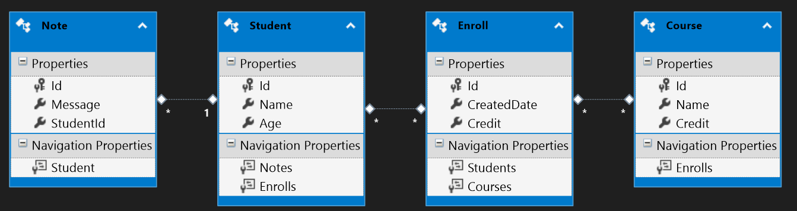

## Programming in the BIG picture
1. Fundamentals
1. Solution design
1. Specific problems 👈
1. Facilitators & Tools

> 🧙‍♂️ For any programming languages

===

<!-- .slide: data-auto-animate data-auto-animate-id="database" -->
## 🗃️

## Database

1. Fundamentals of database
1. Relational database design

---

<!-- .slide: data-auto-animate data-auto-animate-id="database" -->
## Fundamentals of database
💖 DATABASE
> physical [ 📃 , 📃 , 📃 , ... ] → 🐌  
↓  
Queryable  
digital [ 0011, 1010, 1110 , ... ] → 🚀  
↓  
DATA MANIPULATION  
[ 🔠🔢🖼️ ]  
[ 🐷🐶😼😼😼🐭 ]  
🐌 <!-- .element: style="font-size:2.3rem;margin:0px 0px 0px 0px" -->

> 🍾 Programming techniques <!-- .element: style="font-size:2.3rem;margin:0px 0px 0px 0px" -->

---

<!-- .slide: data-auto-animate data-auto-animate-id="database" -->
## Fundamentals of database
### 💖 Data Manipulation

( Entities + Relationships ) & Use cases 🦸

Programming techniques*
<!-- .element: style="font-size:1rem" -->

===

<!-- .slide: data-auto-animate data-auto-animate-id="database" -->
## Relational database design

Entities + Attribute + Relationships

---

<!-- .slide: data-auto-animate data-auto-animate-id="database" -->
## Relational database design

|Name|Meaning|
|--|--|
|Primary key|A single column value used to identify a database record uniquely.|
|Composite key|A primary key composed of multiple columns used to identify a record uniquely.|
|Foreign key|An attribute that references the primary key of another Table.|
|Transitive functional dependencies|When changing a non-key column, might cause any of the other non-key columns to change.|
<!-- .element: style="font-size:1.8rem" -->

---

<!-- .slide: data-auto-animate data-auto-animate-id="database" -->
## Relational database design
### 🍿 Entities + Attribute + Relationships 
( ER diagram )

|Relationship|Action|
|--|--|
|1 - 1|1-PrimaryKey → 1-table as a ForeignKey|
|1 - N|1-PrimaryKey → N-table as a ForeignKey.|
|M - N|Create a new table ← Copy M&N-PrimaryKeys as a ForeignKey.|
<!-- .element: style="font-size:1.8rem" -->

> MultiValue, RepeatingGroup
<!-- .element: style="width:100%;font-size:2rem" -->

---

<!-- .slide: data-auto-animate data-auto-animate-id="database" -->
## Relational database design
[Normalization](https://en.wikipedia.org/wiki/Database_normalization)

> It is a database design technique that reduces data redundancy (repetitive) by divides larger tables into smaller tables and links them using relationships.
<!-- .element: style="font-size:1.8rem" -->
|UNF|1NF|2NF|3NF|EKNF|BCNF|4NF|ETNF|5NF|DKNF|6NF|
|--|--|--|--|--|--|--|--|--|--|--|
<!-- .element: style="font-size:1.8rem" -->

---

<!-- .slide: data-auto-animate data-auto-animate-id="database" -->
## Relational database design
[Normalization](https://en.wikipedia.org/wiki/Database_normalization)

|Normal form|Action|
|--|--|
|UNF|-|
|1NF|~MultiValue, RepeatingGroup~|
|2NF|Single Column Primary Key that does not functionally dependant on any subset of candidate key relation.|
|3NF|~Transitive functional dependencies~|
|BCNF|All determinant must be a CandidateKey|
|4NF|If no database table instance contains two or more, independent and multivalued data describing the relevant entity.|
|5NF|it cannot be decomposed into any number of smaller tables without loss of data.|
|6NF|The row contains the Primary Key, and at most one other attribute.|
<!-- .element: style="font-size:1.4rem" -->

😫 Hard to maintain, query and poor performance

---

<!-- .slide: data-auto-animate data-auto-animate-id="database" -->
## Relational database design
[Normalization](https://en.wikipedia.org/wiki/Database_normalization)

|Simple rules|
|--|
|Each table MUST Have a PrimaryKey and MUST haven't MultiValue, CompositeKey and RepeatingGroup.|
<!-- .element: style="font-size:1.8rem" -->

---

<!-- .slide: data-auto-animate data-auto-animate-id="database" -->
## Relational database design
### 🎮 Normalization + Use cases 🦸