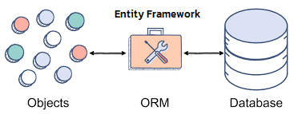
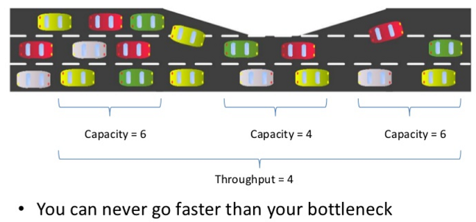
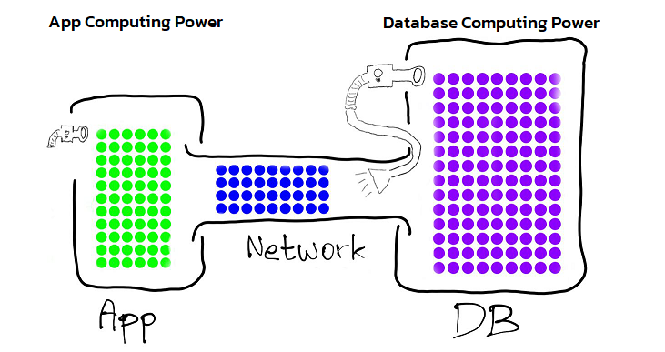
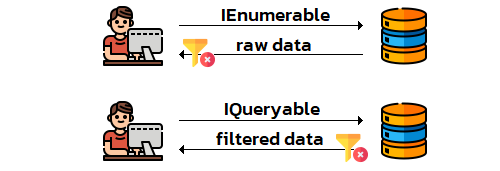
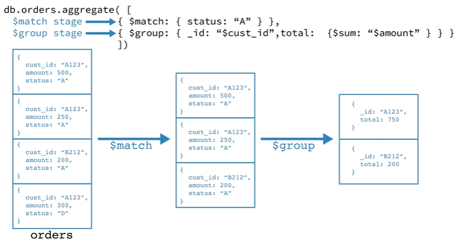
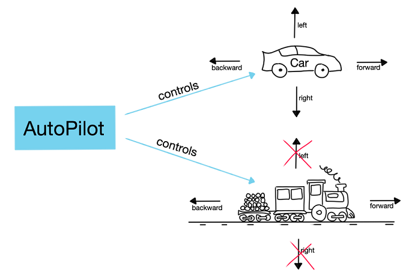

## Programming in the BIG picture
1. Fundamentals
1. Solution design
1. Specific problems 👈
1. Facilitators & Tools

> 🧙‍♂️ For any programming languages

===

<!-- .slide: data-auto-animate data-auto-animate-id="entityframework" -->
## 🗃️

## Working with Database in C#
## [Entity Framework](https://docs.microsoft.com/en-us/ef/)

---

<!-- .slide: data-auto-animate data-auto-animate-id="entityframework" -->
## Entity Framework
What's EF ?

> It is a modern object-database mapper (ORM) for .NET. It supports LINQ queries, change tracking, updates, and schema migrations. EF works with SQL Server, Azure SQL Database, SQLite, Azure Cosmos DB, MySQL, PostgreSQL, and other databases through a provider plugin API.
<!-- .element: style="font-size:1.7rem" -->



---

<!-- .slide: data-auto-animate data-auto-animate-id="entityframework" -->
## Entity Framework
Working with databases

1. [Database-First Approach](https://docs.microsoft.com/en-us/ef/ef6/modeling/designer/workflows/database-first) - Creates Database and its tables first then start the EF from an existing database.
1. [Model-First Approach](https://docs.microsoft.com/en-us/ef/ef6/modeling/designer/workflows/model-first) - Using Entity Framework Designer to create models first then create a database from that models.
1. [Code-First Approach](https://docs.microsoft.com/en-us/ef/ef6/modeling/code-first/workflows/new-database) - Creates classes for your domain entity that match your database design first then create a database from those classes.

---

<!-- .slide: data-auto-animate data-auto-animate-id="entityframework" -->
## Entity Framework
### 🍿 Demo

---

<!-- .slide: data-auto-animate data-auto-animate-id="entityframework" -->
## Entity Framework
[EF Core vs EF 6](https://docs.microsoft.com/en-us/ef/efcore-and-ef6)

||EF Core|EF 6|
|--|--|--|
|Legacy features|Some|All|
|New features|All|No longer|
|Performance|👍|👎|
|Security|👍|👍|

---

<!-- .slide: data-auto-animate data-auto-animate-id="entityframework" -->
## Entity Framework

Guidance for existing EF6 applications
1. Keep using EF6 if the data access code is stable and not likely to evolve or need new features. <!-- .element: style="font-size:1.8rem" -->
1. Port to EF Core if the data access code is evolving or if the app needs new features only available in EF Core. <!-- .element: style="font-size:1.8rem" -->
1. Porting to EF Core is also often done for performance. However, not all scenarios are faster, so do some profiling first. <!-- .element: style="font-size:1.8rem" -->
1. It is possible to use EF Core and EF6 in the same application or library by installing both NuGet packages. <!-- .element: style="font-size:1.8rem" -->

---

<!-- .slide: data-auto-animate data-auto-animate-id="entityframework" -->
## Entity Framework
CRUD (Create-Read-Update-Delete)

```csharp
var db = new SaladpukDbContext();

// Create
var student = new Student
{
	Age = 20,
	Name = "Au",
};
db.Students.Add(student);
await db.SaveChangesAsync();

// Read
foreach (var item in db.Students.Where(it => it.Age == 20))
{
	Console.WriteLine($"{item.Age}, {item.Name}");
}

// Update
student.Name = "Sakul";
await db.SaveChangesAsync(student);

// Delete
db.Students.Remove(student);
await db.SaveChangesAsync();
```
<!-- .element: style="width:65%;font-size:1.1rem" -->

---

<!-- .slide: data-auto-animate data-auto-animate-id="entityframework" -->
## Entity Framework
How to extend EF's models

> [partial](https://docs.microsoft.com/en-us/dotnet/csharp/programming-guide/classes-and-structs/partial-classes-and-methods) keyword is for split the definition of a class, a struct, an interface or a method over two or more source files.
<!-- .element: style="font-size:1.5rem" -->

```csharp
// EF/SaladpukDbModelContainer.cs
public partial class SaladpukDbModelContainer : DbContext
{
}
```
<!-- .element: style="width:80%;font-size:1.4rem" -->

```csharp
// SaladpukDbModelContainer.cs
public partial class SaladpukDbModelContainer
{
	public bool DeleteDatabase()
		=> Database.Delete();
}
```
<!-- .element: style="width:80%;font-size:1.4rem" -->
```csharp
var db = new SaladpukDbContext();
db.DeleteDatabase();
```
<!-- .element: style="width:80%;font-size:1.4rem" -->

---

<!-- .slide: data-auto-animate data-auto-animate-id="entityframework" -->
## Entity Framework
💖 Bottlenecks

 <!-- .element: class="fade-out" -->
 <!-- .element: class="fragment" -->
<!-- .element: class="r-stack" -->

1. Database design & Query <!-- .element: style="font-size:1.4rem" -->
1. Network Latency <!-- .element: style="font-size:1.4rem" -->
1. App Resource <!-- .element: style="font-size:1.4rem" -->

---

<!-- .slide: data-auto-animate data-auto-animate-id="entityframework" -->
## Entity Framework
💖 Bottlenecks

> Query with IQueryable ⚔️ IEnumerable
<!-- .element: style="font-size:1.5rem" -->



---

<!-- .slide: data-auto-animate data-auto-animate-id="entityframework" -->
## Entity Framework
💖 Bottlenecks

> LINQ Aggregations
<!-- .element: style="font-size:1.5rem" -->



---

<!-- .slide: data-auto-animate data-auto-animate-id="entityframework" -->
## Entity Framework
💖 Bottlenecks

```csharp
// Aggregations -> Aggregate()
var orders = new[]
{
    new Order{ Id = "A123", Category = "Food", Amount = 500 },
    new Order{ Id = "A123", Category = "Food", Amount = 250 },
    new Order{ Id = "B456", Category = "Food", Amount = 200 },
    new Order{ Id = "C789", Category = "Docs", Amount = 300 },
    new Order{ Id = "D789", Category = "Food", Amount = 100 },
};

Func<Order, Order, Order> summaryFn = (p, n) =>
{
    p.Amount += n.Amount;
    return p;
};
var result = orders
    .Where(it => it.Category == "Food")
    .GroupBy(it => it.Id)
    .Select(it => it.Aggregate(summaryFn));

foreach (var item in result)
{
    Console.WriteLine($"{item.Id} {item.Category} {item.Amount}");
}
```
<!-- .element: style="width:65%;font-size:1rem" -->

---

<!-- .slide: data-auto-animate data-auto-animate-id="entityframework" -->
## Entity Framework
💖 Bottlenecks

> (Create - Update - Delete) with thousands or millions of entities cause poor performance instantly.
<!-- .element: style="font-size:1.5rem" -->

```csharp
await dbContext.SaveChangesAsync();
```
<!-- .element: style="width:50%;" -->

[Tools & Extensions](https://docs.microsoft.com/en-us/ef/core/extensions)

```csharp
context.BulkInsert(entities);                 context.BulkInsertAsync(entities);
context.BulkInsertOrUpdate(entities);         context.BulkInsertOrUpdateAsync(entities);
context.BulkInsertOrUpdateOrDelete(entities); context.BulkInsertOrUpdateOrDeleteAsync(entities);
context.BulkUpdate(entities);                 context.BulkUpdateAsync(entities);
context.BulkDelete(entities);                 context.BulkDeleteAsync(entities);
context.BulkRead(entities);                   context.BulkReadAsync(entities);
context.BulkSaveChanges();                    context.BulkSaveChangesAsync();       
```
<!-- .element: style="width:100%;font-size:1.1rem" -->

---

<!-- .slide: data-auto-animate data-auto-animate-id="entityframework" -->
## Entity Framework
⚒️ Techniques

1. Save a file in your database
1. Upload a file from your website
1. Database indxing
1. Soft delete vs Hard delete

---

<!-- .slide: data-background="pink" -->
## 💖 SOLID Design Principles
### Liskov Substitution Principle (LSP)

> Let Φ(x) be a property provable about objects x of type T. Then Φ(y)_should be true for objects _y of type S where S is a subtype of T

---

<!-- .slide: data-background="pink" -->
## 💖 SOLID Design Principles
### Liskov Substitution Principle (LSP)


---

<!-- .slide: data-background="pink" -->
## 💖 SOLID Design Principles
### Interface Segregation Principle (ISP)

> Clients should not be forced to depend on methods they do not use.

---

<!-- .slide: data-background="pink" -->
## 💖 SOLID Design Principles
### Interface Segregation Principle (ISP



===

# 🦭 
## C# Professional at Work
* Basic → Advanced programming
* Object Oriented Programming
* Database design
* Entity Framework
* Design guidelines
* Best practices